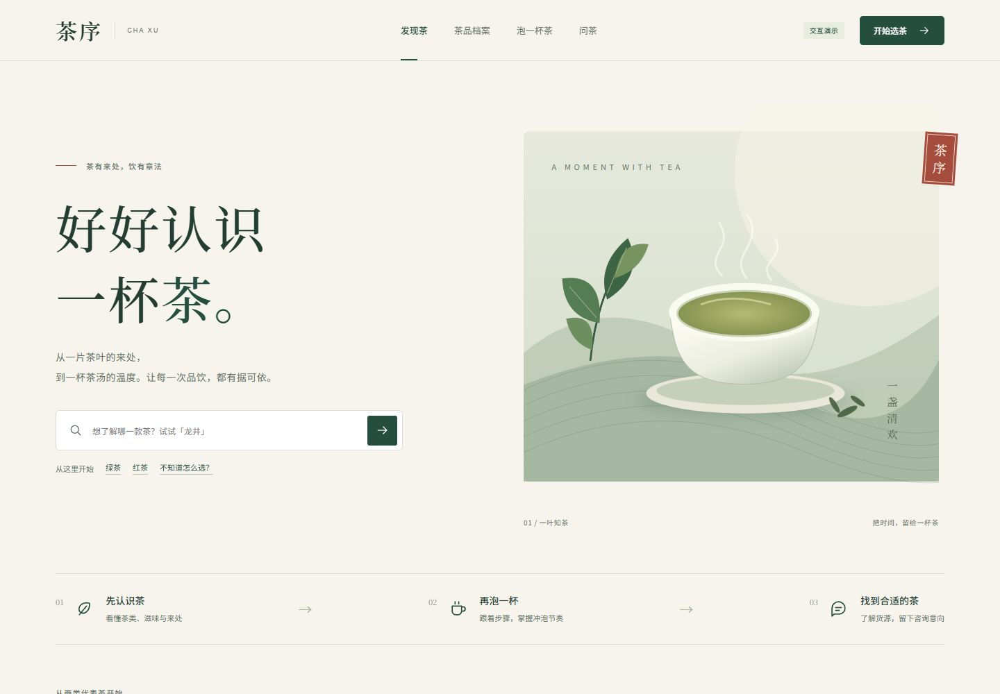

# 茶序 · 茶文化智能体

茶序是一个围绕茶品资料、分步冲泡、知识问答、货源咨询和内容运营构建的茶文化智能体 MVP。当前仓库包含可交互的 React 前端原型、前后端接口契约、Figma 设计状态、验收截图及版本快照记录。

GitHub 仓库：<https://github.com/1747754480xiejiaming-wq/->

版本状态：`main` 保存已验证快照；后续每次代码或画布更新都会同步维护本 README、快照记录并推送。



## 当前进度

- 用户端：首页已升级为七幕沉浸式滚动叙事，依次呈现首页、茶史四章、茶叶品类、参考资料与联系我们；桌面使用 Sticky 原生滚动、滚动停止自动吸附和单幕互斥显示，移动端使用真实文档流和纵向邻近吸附。检索与筛选、茶品和批次档案、功效与资料来源、问茶与分步冲泡联动、货源、咨询和脱敏回执均可交互。
- 管理后台：按数据运营、客户审核、线索跟进和项目管理员拆分四套职能前端；内容与导入合并，审核通过自动发布，数据运营和项目管理员可直接上下架商品。
- 响应式：本轮复核 1440×900 桌面七幕和 390×844 移动端；既有 768、390 和 375 宽度业务页面检查继续有效。
- UI 细节：主导航活动指示条已居中文字；茶品详情批次选择已统一为米白、深茶绿风格的自定义菜单并支持键盘操作；首页竖排滚动提示已移入正文左侧留白区；首页茶图和印章已向左收进安全区，与右侧场景进度栏保持稳定间距。
- 运营规则：草稿置顶；数据运营可删除草稿，项目管理员可删除商品；两者均可按状态互斥地上下架商品。重新上架保留当前版本、无需客户审核人再次授权；演示来源曾被撤回时同步恢复来源状态，确保用户端立即可见。
- 数据状态：浏览器仍使用本机演示数据；已建立仅供本地联调的 FastAPI 契约服务骨架（`/health/live`、`/api/v1/config`），尚未接入数据库、身份系统或真实大模型，配置明确标识为 `demo`。
- 设计画布：Figma 已新增 8 个桌面端与 3 个移动端可编辑网页捕获；Penpot 已建立 7 页备用评审画布，覆盖桌面端、移动端、设计令牌、组件状态与关键流程。

## 快速开始

需要 Node.js 22 或更高版本。

```powershell
cd prototype
npm ci
npm run dev
```

### 后端契约服务（本地联调骨架）

需要 Python 3.10 或更高版本。此阶段只提供进程存活检查与非生产的公开配置；不会创建数据库或提供真实资料、登录及模型能力。

```powershell
cd backend
python -m pip install -e ".[dev]"
python -m uvicorn app.main:app --port 8000
```

健康检查：<http://127.0.0.1:8000/health/live>，预期仅返回 `{"status":"ok"}`。公开配置入口为 <http://127.0.0.1:8000/api/v1/config>，所有业务 API 将固定在 `/api/v1` 下；机器可读契约见 [`contracts/openapi.yaml`](contracts/openapi.yaml)。

打开：

- 用户端：<http://127.0.0.1:4173/>
- 管理后台：<http://127.0.0.1:4173/#/admin>

生产构建检查：

```powershell
cd prototype
npm run build
```

## 建议体验流程

1. 搜索 `LJ-050`，比较西湖龙井 2026 与 2025 两个批次。
2. 查看资料来源和货源状态，体验有效报价与过期报价的差异。
3. 在“问茶 · 泡一杯”询问“西湖龙井怎么泡”，由回答自动带入茶品、投茶量、水温、时间与四步冲泡流程。
4. 使用示例内容提交咨询，主动勾选用途同意，查看脱敏回执。
5. 进入后台，依次切换数据运营、客户审核人、线索跟进和项目管理员身份。
6. 体验草稿、审核、发布、下架、免复审重新上架、导入错误、来源撤回和操作记录。

## 设计与开发资料

| 内容 | 位置 |
|---|---|
| 前端原型说明 | [`prototype/README.md`](prototype/README.md) |
| 前后端接口契约与 Skill 清单 | [`茶文化智能体_前后端接口契约与Skill清单.md`](茶文化智能体_前后端接口契约与Skill清单.md) |
| 机器可读 API 契约 | [`contracts/openapi.yaml`](contracts/openapi.yaml) |
| 后端服务 | [`backend/`](backend/) |
| 浏览器验收记录 | [`prototype/验收记录.md`](prototype/验收记录.md) |
| 首页滚动与问茶冲泡融合设计 | [`docs/superpowers/specs/2026-09-10-home-scroll-qa-brewing-design.md`](docs/superpowers/specs/2026-09-10-home-scroll-qa-brewing-design.md) |
| 沉浸式 Sticky 滚动首页设计 | [`docs/superpowers/specs/2026-09-11-envision-scroll-home-design.md`](docs/superpowers/specs/2026-09-11-envision-scroll-home-design.md) |
| 沉浸式 Sticky 首页实施计划 | [`docs/superpowers/plans/2026-09-11-immersive-sticky-home-implementation.md`](docs/superpowers/plans/2026-09-11-immersive-sticky-home-implementation.md) |
| 设计画布工作流 | [`prototype/设计画布工作流.md`](prototype/设计画布工作流.md) |
| Figma 状态 | [`work/figma-prototype/state.json`](work/figma-prototype/state.json) |
| 设计快照 | [`design-snapshots/`](design-snapshots/) |
| 页面验收截图 | [`output/playwright/`](output/playwright/) |
| 版本快照记录 | [`VERSION_SNAPSHOTS.md`](VERSION_SNAPSHOTS.md) |

Figma 主文件：[茶序 · 茶文化智能体产品原型](https://www.figma.com/design/cRMwXR1psHjb4MgkhD5WC2)。Figma 当前包含基础变量、文字样式、Button/Input/Badge 组件，以及用户端与后台的桌面和移动页面捕获。

Penpot 备用文件：[茶序 · 前端原型备份画布](https://design.penpot.app/#/workspace?team-id=40e06342-8830-80d6-8008-9dca1ec2817d&file-id=c828d3cf-7d4e-8145-8008-9dcadfc52fa0&page-id=2fd4944b-225d-804f-8008-9dccb0930c71)。本轮 Figma `use_figma` 因 Starter 调用上限受阻，按既定规则改由 Penpot 完成备用画布，并保留回同步清单。

最新画布快照见 [`design-snapshots/20260910-002-figma-penpot-pages.json`](design-snapshots/20260910-002-figma-penpot-pages.json)；最新项目快照见 [`VERSION_SNAPSHOTS.md`](VERSION_SNAPSHOTS.md) 中的 `SNAP-20260911-016`。

## 目录结构

```text
prototype/             React + TypeScript + Vite 交互原型
backend/               FastAPI 本地契约服务（当前仅健康检查和公开配置）
contracts/             OpenAPI v1 机器可读契约
design-snapshots/      Figma/Penpot 画布版本清单
output/playwright/     桌面、平板和移动端验收截图
work/figma-prototype/  Figma 构建脚本与状态记录
prd_outputs/           产品与开发方案交付资料
```

## 版本快照与回滚

每次代码或画布改动完成并验证后，都要同步更新本 README 和 [`VERSION_SNAPSHOTS.md`](VERSION_SNAPSHOTS.md)，然后创建独立 Git 提交并推送到 GitHub。

提交格式：

- `snapshot(code): <代码变更摘要>`
- `snapshot(canvas): <画布变更摘要>`
- `snapshot(full): <代码与画布变更摘要>`

查看版本：

```powershell
git log --oneline --decorate
```

从指定快照建立恢复分支：

```powershell
git switch -c restore/<名称> <commit-sha>
```

详细规则见 [`AGENTS.md`](AGENTS.md)。已经推送的快照不会重写或删除，除非项目所有者明确要求。

## 实施边界

当前仓库用于产品交互、视觉和接口约束验证。正式上线前仍需实现服务端接口、持久化数据库、身份认证与授权、真实资料检索、模型调用、文件存储、并发控制、幂等提交、审计存储和部署配置。
