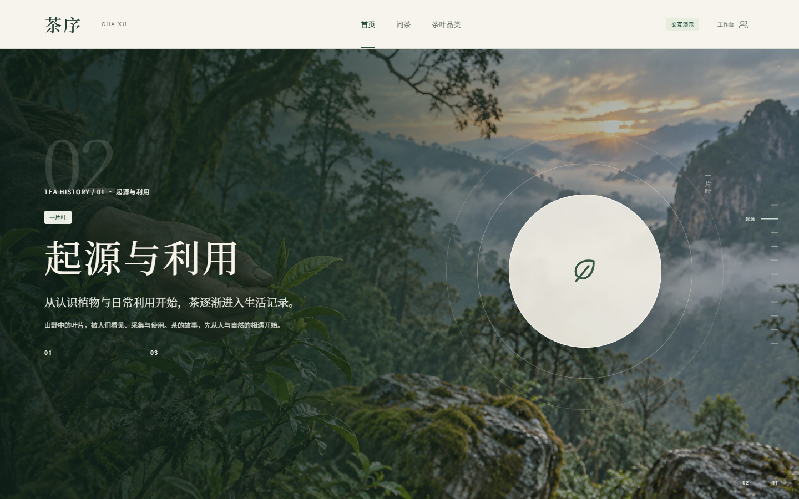

# 茶序 · 茶文化智能体

茶序是一个围绕茶品资料、分步冲泡、知识问答、货源咨询和内容运营构建的茶文化智能体 MVP。当前仓库包含可交互的 React 前端原型、前后端接口契约、Figma 设计状态、验收截图及版本快照记录。

GitHub 仓库：<https://github.com/1747754480xiejiaming-wq/->

版本状态：后端开发工作区现为代码与界面的唯一基线；`main`、`codex/tea-backend-integration` 以及前后端两个开发任务将同步到同一提交。覆盖前的旧前端历史完整保存在 `archive/frontend-before-backend-sync-20260911`，可用于恢复。后续每次代码或画布更新都会同步维护本 README、快照记录并推送。



## 当前进度

- 工作区同步：登录页和管理后台以后端开发任务中的四智能体实现为准，前端开发任务不再保留另一套 `LoginPage`、mock/live service 或后台页面实现。
- 用户端：首页已升级为十一幕沉浸式滚动叙事，依次呈现首页、茶史八页、茶叶品类、参考资料与联系我们；茶史采用“起源与利用 3 页 + 茶事与交流 3 页 + 制茶与分类 2 页”的完整结构。网页第 2–9 页已按 `1.png` 至 `8.png` 的文件名顺序换为八张全屏图片背景，并使用深茶绿渐变保证文字可读性；原始约 20 MB PNG 已转换为合计约 1.84 MB 的 WebP。桌面使用 Sticky 原生滚动、滚动停止自动吸附和单幕互斥显示，移动端使用真实文档流和纵向邻近吸附。检索与筛选、茶品和批次档案、功效与资料来源、问茶与分步冲泡联动、货源、咨询和脱敏回执均可交互。
- 公共导航：桌面顶部文字导航为“首页 / 问茶 / 茶叶品类”，右上角提供低强调“工作台”按钮；移动底部继续保留“首页 / 问茶 / 茶叶品类 / 工作台”。“问茶”进入 `#/qa`，“茶叶品类”进入商品总览 `#/catalog`，“工作台”进入 `#/admin`，并由登录页调用后端 CSRF 与登录接口。
- 管理后台：新增真实登录界面，数据运营、客户审核、线索跟进和项目管理四个智能体分别对应 `operator`、`reviewer`、`lead`、`admin` 后端账号；登录态、CSRF 与岗位权限由后端确认。四套职能前端继续独立展示，审核通过自动发布，数据运营和项目管理员可直接上下架商品。
- 响应式：本轮复核 1440×900 桌面十一幕和 390×844 移动端八页茶史；移动页面 `scrollWidth` 与视口同为 390px，既有 768、390 和 375 宽度业务页面检查继续有效。
- UI 细节：主导航活动指示条已居中文字；茶品详情批次选择已统一为米白、深茶绿风格的自定义菜单并支持键盘操作；首页竖排滚动提示已移入正文左侧留白区；首页茶图和印章已向左收进安全区，与右侧场景进度栏保持稳定间距。
- 运营规则：草稿置顶；数据运营可删除草稿，项目管理员可删除商品；两者均可按状态互斥地上下架商品。重新上架保留当前版本、无需客户审核人再次授权；演示来源曾被撤回时同步恢复来源状态，确保用户端立即可见。
- 数据状态：已建立可运行的 FastAPI 模块化后端、SQLite 本地持久化、PostgreSQL 配置入口、Alembic 基线、四角色会话、审核发布状态机、公开过滤、问茶/冲泡、咨询线索、审计与 CSV 导入；资料和规则问答仍明确标识为 `demo`，未接入真实大模型或对象存储。
- 写入保护：登录、公开写入和后台写入校验可信 `Origin`；Cookie 会话写入同时校验 CSRF；审核、上下架、逻辑删除、CSV 校验/提交等命令支持数据库持久化幂等重放，并与 `If-Match` 乐观锁配合。
- 前后端切换：前端新增类型化 API 边界；设置 `VITE_API_BASE_URL` 后从后端加载公开茶品及对应冲泡配方，并启用后台真实登录、会话恢复与退出。公开数据服务不可用时仍保留原有 localStorage 演示数据，但后台登录不会降级为前端伪造身份。
- 设计画布：Figma 已新增 8 个桌面端与 3 个移动端可编辑网页捕获；Penpot 已建立 7 页备用评审画布，覆盖桌面端、移动端、设计令牌、组件状态与关键流程。

## 快速开始

### Windows 一键启动（推荐）

在仓库根目录双击 [`一键启动本地测试.cmd`](一键启动本地测试.cmd)。启动器会自动：

1. 检查 Python 3.12、Node.js 22 和端口；在 Codex 环境中可自动发现自带的 Python 3.12。
2. 首次运行时创建 `backend/.venv` 并安装后端依赖；前端依赖缺失时执行 `npm ci`。
3. 执行数据库迁移和演示数据初始化，启动 API 与 Vite 网站。
4. 两端就绪后使用默认浏览器打开 <http://127.0.0.1:4173/>。

重复双击时，如果两端已经正常运行，启动器会直接再次打开网站，不会因端口占用报错。若只有一个端口被占用或服务异常，窗口会保留并显示中文错误，不会结束其他程序。

### 手动启动

需要 Node.js 22 或更高版本。

```powershell
cd prototype
npm ci
npm run dev
```

连接本地后端时，在启动前端的同一终端设置：

```powershell
$env:VITE_API_BASE_URL="http://127.0.0.1:8000/api/v1"
npm run dev
```

### 后端服务（本地联调）

需要 Python 3.12 或更高版本。默认数据库为 `backend/tea_sequence.db`，仅用于本机联调；正式环境通过 `DATABASE_URL=postgresql+psycopg://...` 切换 PostgreSQL。

```powershell
cd backend
python -m pip install -e ".[dev]"
python -m alembic upgrade head
python -m app.seed
python -m uvicorn app.main:app --port 8000
```

健康检查：<http://127.0.0.1:8000/health/live>；就绪检查：<http://127.0.0.1:8000/health/ready>；交互文档：<http://127.0.0.1:8000/docs>。业务 API 固定在 `/api/v1`，机器可读基线见 [`contracts/openapi.yaml`](contracts/openapi.yaml)。演示账号只记录在 [`backend/.env.example`](backend/.env.example) 中。

后端已覆盖茶叶/批次、功效、冲泡、货源、来源授权、问茶、咨询、反馈、事件、内容草稿/审核/自动发布、下架/免复审重新上架、逻辑删除、账号权限、线索跟进、审计及 UTF-8 CSV 导入。公开文件、XLSX、真实模型和持久导出工作进程未配置时返回明确错误，不伪造成功。

安装依赖后，也可以从仓库根目录手动一次启动两端并执行冒烟检查：

```powershell
.\scripts\run-local-integration.ps1 -Seed -Smoke
```

脚本会先检查 Python 3.12、Node.js 22、依赖和端口，再执行迁移与可选种子，启动 API/Vite 并验证就绪、公开目录和脱敏咨询回执。它不会删除数据库或停止已占用端口的其他进程；成功后会打印本次进程 PID。完整证据与 T01–T23 覆盖边界见 [`docs/acceptance/backend-local-integration.md`](docs/acceptance/backend-local-integration.md)。

打开：

- 用户端：<http://127.0.0.1:4173/>
- 工作台登录：<http://127.0.0.1:4173/#/admin>

四个本地演示账号使用统一密码 `TeaDemo2026!`：

| 智能体 | 账号 |
|---|---|
| 数据运营智能体 | `operator` |
| 客户审核智能体 | `reviewer` |
| 线索跟进智能体 | `lead` |
| 项目管理智能体 | `admin` |

生产构建检查：

```powershell
cd prototype
npm run build
```

## 建议体验流程

1. 搜索 `LJ-050`，比较西湖龙井 2026 与 2025 两个批次。
2. 查看资料来源和货源状态，体验有效报价与过期报价的差异。
3. 在“问茶 · 泡一杯”询问“西湖龙井怎么泡”，由回答自动带入茶品、投茶量、水温、时间与四步冲泡流程。
4. 使用示例内容提交咨询，主动勾选用途同意，查看脱敏回执。
5. 从右上角低强调“工作台”按钮进入后端登录页；登录前可用“返回用户端”回到首页，登录后可依次退出并登录数据运营、客户审核、线索跟进和项目管理四个智能体，核对各自导航与岗位边界。
6. 体验草稿、审核、发布、下架、免复审重新上架、导入错误、来源撤回和操作记录。

## 设计与开发资料

| 内容 | 位置 |
|---|---|
| 前端原型说明 | [`prototype/README.md`](prototype/README.md) |
| 前后端接口契约与 Skill 清单 | [`茶文化智能体_前后端接口契约与Skill清单.md`](茶文化智能体_前后端接口契约与Skill清单.md) |
| 机器可读 API 契约 | [`contracts/openapi.yaml`](contracts/openapi.yaml) |
| 后端服务 | [`backend/`](backend/) |
| 本地联调验收 | [`docs/acceptance/backend-local-integration.md`](docs/acceptance/backend-local-integration.md) |
| 浏览器验收记录 | [`prototype/验收记录.md`](prototype/验收记录.md) |
| 首页滚动与问茶冲泡融合设计 | [`docs/superpowers/specs/2026-09-10-home-scroll-qa-brewing-design.md`](docs/superpowers/specs/2026-09-10-home-scroll-qa-brewing-design.md) |
| 沉浸式 Sticky 滚动首页设计 | [`docs/superpowers/specs/2026-09-11-envision-scroll-home-design.md`](docs/superpowers/specs/2026-09-11-envision-scroll-home-design.md) |
| 沉浸式 Sticky 首页实施计划 | [`docs/superpowers/plans/2026-09-11-immersive-sticky-home-implementation.md`](docs/superpowers/plans/2026-09-11-immersive-sticky-home-implementation.md) |
| 茶史时间线与工作台入口实施计划 | [`docs/superpowers/plans/2026-09-11-history-timeline-workbench-entry.md`](docs/superpowers/plans/2026-09-11-history-timeline-workbench-entry.md) |
| 设计画布工作流 | [`prototype/设计画布工作流.md`](prototype/设计画布工作流.md) |
| Figma 状态 | [`work/figma-prototype/state.json`](work/figma-prototype/state.json) |
| 设计快照 | [`design-snapshots/`](design-snapshots/) |
| 茶史背景转换脚本 | [`work/convert-tea-history-images.mjs`](work/convert-tea-history-images.mjs) |
| 页面验收截图 | [`output/playwright/`](output/playwright/) |
| 版本快照记录 | [`VERSION_SNAPSHOTS.md`](VERSION_SNAPSHOTS.md) |

Figma 主文件：[茶序 · 茶文化智能体产品原型](https://www.figma.com/design/cRMwXR1psHjb4MgkhD5WC2)。Figma 当前包含基础变量、文字样式、Button/Input/Badge 组件，以及用户端与后台的桌面和移动页面捕获。

Penpot 备用文件：[茶序 · 前端原型备份画布](https://design.penpot.app/#/workspace?team-id=40e06342-8830-80d6-8008-9dca1ec2817d&file-id=c828d3cf-7d4e-8145-8008-9dcadfc52fa0&page-id=2fd4944b-225d-804f-8008-9dccb0930c71)。本轮 Figma `use_figma` 因 Starter 调用上限受阻，按既定规则改由 Penpot 完成备用画布，并保留回同步清单。

最新画布快照见 [`design-snapshots/20260910-002-figma-penpot-pages.json`](design-snapshots/20260910-002-figma-penpot-pages.json)；最新项目快照见 [`VERSION_SNAPSHOTS.md`](VERSION_SNAPSHOTS.md) 中的 `SNAP-20260912-028`。

## 目录结构

```text
prototype/             React + TypeScript + Vite 交互原型
backend/               FastAPI + SQLAlchemy + Alembic 后端与 pytest 集成测试
contracts/             OpenAPI v1 机器可读契约
design-snapshots/      Figma/Penpot 画布版本清单
output/playwright/     桌面、平板和移动端验收截图
work/figma-prototype/  Figma 构建脚本与状态记录
scripts/               非破坏性本地联调启动脚本
prd_outputs/           产品与开发方案交付资料
```

## 版本快照与回滚

每次代码或画布改动完成并验证后，都要同步更新本 README 和 [`VERSION_SNAPSHOTS.md`](VERSION_SNAPSHOTS.md)，然后创建独立 Git 提交并推送到 GitHub。

提交格式：

- `snapshot(code): <代码变更摘要>`
- `snapshot(canvas): <画布变更摘要>`
- `snapshot(full): <代码与画布变更摘要>`

查看版本：

```powershell
git log --oneline --decorate
```

从指定快照建立恢复分支：

```powershell
git switch -c restore/<名称> <commit-sha>
```

详细规则见 [`AGENTS.md`](AGENTS.md)。已经推送的快照不会重写或删除，除非项目所有者明确要求。

## 实施边界

当前仓库已具备本地联调后端，但仍属于演示交付。正式上线前需要接入并验证 PostgreSQL、真实来源及授权、对象存储、检索索引、模型适配器、后台任务、生产 Cookie/域名、备份恢复和部署配置。
