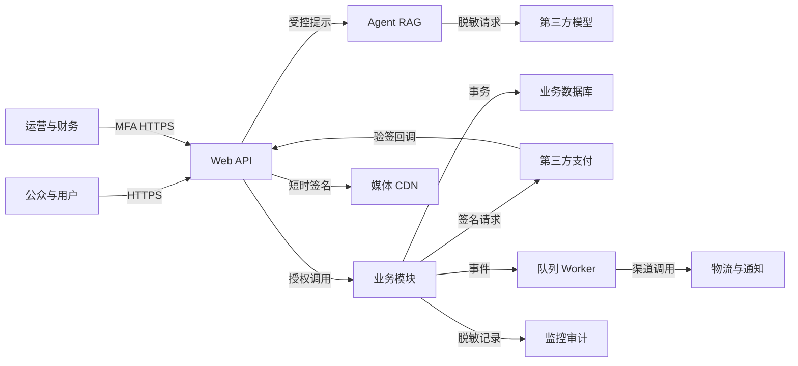

# 茶文化智能体安全威胁模型

**版本：** 1.0
**日期：** 2026-09-07
**状态：** 设计期模型，实施后必须复审
**范围：** 比赛版与商业化版的公开 Web、API、智能体/RAG、内容后台，以及商业化版课程、商品、订单、支付、退款、物流和运营能力

## Executive summary

最高风险集中在四处：AI 提示注入与知识投毒、对象级越权和员工权限滥用、支付/库存/权益的非幂等与伪造回调、个人信息或第三方密钥泄露。比赛版不处理真实交易，其主要风险是错误内容、模型额度型拒绝服务和后台接管；商业化版一旦接入支付、地址和课程权益，交易完整性与隐私风险上升为上线阻断项。本仓库目前只有设计文档，没有运行代码，因此不存在已被证实的代码级安全控制；以下控制均是发布要求，后续必须以实现、配置、测试和日志证据重新验证。

## Scope and assumptions

**范围内路径：**

- `prd_outputs/茶文化智能体/茶文化智能体_比赛版_开发方案.md`
- `prd_outputs/茶文化智能体/茶文化智能体_商业化版_开发方案.md`
- 后续按方案建立的 `src/identity/`、`src/agent/`、`src/rag/`、`src/orders/`、`src/payments/`、`src/inventory/`、`src/entitlements/`、`src/privacy/`、`src/admin/` 与 `infra/`

**范围外：** 自营支付、银行卡存储、商户入驻、多租户 SaaS、原生 App、直播、社区 UGC、线下仓储系统和自主替用户下单。

**已由用户确认的假设：**

- 产品面向互联网公开访问，首发为中文响应式 Web/H5。
- 大模型由第三方 API 提供；服务端持有密钥，并对出站内容最小化和脱敏。
- 商业化版由单一合法运营主体经营，通过持牌第三方支付，不保存卡号或支付密码。
- 保存的数据可能包括账号、联系方式、收货地址、对话、学习进度、订单和售后信息。
- 权限至少区分访客、用户、内容/商品运营、客服、财务和管理员。
- 比赛版不发生真实支付，只记录匿名行为和经同意的意向信息。

**会实质改变评级的开放问题：**

- 若未来开放商户入驻或学校/机构租户，跨租户访问将上升为严重风险并需要独立数据隔离设计。
- 若供应商将提示或对话用于训练，或数据出境条件改变，第三方模型数据风险需重新评级。
- 若平台引入储值、分账或余额账户，支付域必须升级为独立资金与账务威胁模型。

## System model

### Primary components

| 组件 | 作用 | 设计证据 |
|---|---|---|
| Web/H5 与运营后台 | 公开问答、浏览、购买、学习和员工运营入口 | 两版方案第 11、15 节 |
| API/身份边界 | 输入校验、会话、RBAC、对象授权、限流 | 商业化 FR-B01、第 10、14 节 |
| Agent/RAG | 意图、检索、重排、提示隔离、引用与护栏 | 两版方案第 9 节 |
| 关系数据库 | 用户、内容、课程、商品、订单、支付、权益和审计 | 两版方案第 13 节 |
| 队列与 Worker | Outbox、通知、索引、物流、分析和补偿 | 商业化第 11、17、19 节 |
| 对象存储/CDN | 图片、附件和课程媒体 | 两版方案第 16 节 |
| 第三方模型 | 语言理解与回答生成 | 两版方案第 16 节 |
| 第三方支付/物流/通知 | 商业交易和履约 | 商业化第 14、16、17 节 |
| 监控与审计 | 脱敏指标、日志、trace、AI 成本和高影响操作 | 两版方案第 10、18、24 节 |

### Data flows and trust boundaries

- **互联网用户 → Web/API：** 问题、测评、账号凭据、订单和售后信息经 HTTPS 进入；要求限流、CSRF/来源保护、schema 校验、身份与资源级授权。
- **员工 → 运营后台/API：** 内容、价格、库存、退款和权限操作经 MFA 会话进入；要求 RBAC、职责分离、二次确认和追加式审计。
- **API → Agent/RAG：** 用户提示、画像和允许的业务上下文经内部接口传递；要求字段白名单、提示/资料隔离和硬性工具权限。
- **Agent/RAG → 第三方模型：** 脱敏提示与已授权检索片段经 TLS API 发出；不得包含支付凭据、明文联系方式或系统密钥。
- **API/业务模块 → 数据库：** 业务状态经参数化查询和事务写入；要求最小数据库权限、加密、备份和并发控制。
- **交易模块 ↔ 第三方支付：** 订单号、金额、商户信息、渠道流水经签名 API/回调交换；要求验签、时间窗、金额与商户校验、主动查询和对账。
- **业务模块 → 队列/Worker：** Outbox 事件异步触发权益、通知、索引和物流；要求幂等消费者、重试、死信和队列积压告警。
- **学习服务 → 媒体/CDN：** 已授权用户获得短时签名地址；要求私有源站、权益校验、到期和盗链检测。
- **运行服务 → 监控/审计：** 脱敏日志、指标和操作摘要进入内部平台；要求字段白名单、访问控制、留存和防篡改。

#### Diagram

## Assets and security objectives

| Asset | Why it matters | Security objective (C/I/A) |
|---|---|---|
| 账号、联系方式、地址、对话 | 个人信息泄露会伤害用户并带来合规风险 | C/I/A |
| 订单、支付、退款、库存、权益 | 错误会造成资金、履约和数字权益损失 | I/A；支付数据 C |
| 知识、来源、提示词、推荐规则 | 决定回答和消费建议的可信度 | I/A；内部提示部分 C |
| 课程媒体与版权资料 | 核心可售数字资产 | C/I/A |
| 模型、支付、存储和渠道密钥 | 泄露可跨系统滥用、窃取数据或制造费用 | C/I |
| 角色、同意和审计记录 | 决定权限、责任追溯与合法处理依据 | I/A |
| 模型额度和服务容量 | 被耗尽会使问答或交易不可用 | A |

## Attacker model

### Capabilities

- 未登录攻击者可构造 HTTP、提示词和上传内容，自动化请求并观察响应差异。
- 注册用户可操纵客户端金额/标识、发起并发重试、尝试访问他人资源及滥用优惠/退款。
- 被盗或恶意员工账号可使用其角色权限访问后台并尝试提权、导出或篡改。
- 恶意资料、外部模型响应、支付/物流回调和依赖包都属于潜在不可信输入。
- 攻击者可利用网络中断、乱序、重复投递和超时触发业务边界条件。

### Non-capabilities

- 默认攻击者没有云控制台、生产数据库或持牌支付机构内部权限。
- 平台不保存银行卡号、支付密码或自有资金账户。
- v1 不存在商户/学校间的多租户边界，也没有可由 Agent 自主执行的支付工具。
- 物理仓库、线下终端和课程拍摄现场不在当前系统范围。

## Entry points and attack surfaces

| Surface | How reached | Trust boundary | Notes | Evidence |
|---|---|---|---|---|
| 注册、登录、找回、MFA | 公开 HTTPS | 互联网→身份服务 | 撞库、枚举、会话固定、验证码滥用 | 商业化 FR-B01 |
| Chat/测评/推荐 | 公开/登录 API | 用户→Agent/业务 | 注入、敏感输入、额度 DoS | 两版 FR-C01/C02、FR-B02/B03 |
| 课程/商品/媒体 | API 与签名 URL | 用户→目录/权益/CDN | 对象越权、盗链、状态过期 | 商业化 FR-B04～B06 |
| 订单/支付/退款 | 登录 API | 用户→交易核心 | 客户端篡改、竞态、重复执行 | 商业化 FR-B07、B10、B11 |
| 支付回调 | 外部 HTTPS | 支付渠道→API | 伪造、重放、乱序、金额不符 | 商业化第 14、17 节 |
| 运营后台 | MFA HTTPS | 员工→高权限模块 | 权限滥用、账号接管、批量导出 | 两版 FR-C06、FR-B08 |
| 内容/媒体导入 | 后台上传/粘贴 | 员工输入→解析/索引/存储 | 恶意文件、知识投毒、间接注入 | 两版第 9 节 |
| 物流/通知回调与 API | 外部接口 | 外部渠道↔Worker | 假状态、PII 过度共享、重试风暴 | 商业化第 16、17 节 |
| 日志、分析、审计 | 内部界面/导出 | 生产→内部系统 | 明文敏感信息、日志投毒、过权访问 | 两版可观测与威胁模型 |

## Top abuse paths

1. **污染回答：** 攻击者或误操作人员把含隐藏指令的资料送入审核 → 内容被发布和索引 → RAG 把指令当资料交给模型 → 多用户收到错误、偏向或泄密回答。
2. **模型越界：** 攻击者提交提示注入 → 模型试图忽略系统规则或索要工具 → 未隔离的编排执行敏感查询 → 暴露内部提示、他人数据或业务状态。
3. **支付绕过：** 攻击者伪造/重放回调或篡改客户端成功状态 → 服务端未验签/查询 → 订单误标已支付 → 免费获得课程权益或商品履约。
4. **竞态获利：** 用户并发提交订单、优惠、退款或库存释放 → 缺少幂等/唯一约束 → 重复权益、重复退款或负库存。
5. **对象越权：** 用户枚举订单、地址、课程或会话标识 → API 只校验登录未校验归属 → 获取他人 PII、订单或课程内容。
6. **后台接管：** 员工凭证被钓鱼 → 攻击者登录高权限后台 → 修改价格/知识、批量导出或批准退款 → 造成资金、隐私与信誉损失。
7. **媒体盗取：** 未购用户获得长期可分享媒体 URL → 绕过权益检查批量下载 → 课程版权和收入损失。
8. **费用型 DoS：** 机器人批量触发大模型、短信或昂贵检索 → 耗尽配额/预算 → 正常用户不可用并产生账单。
9. **供应链与密钥：** 密钥被提交到仓库/日志或依赖包被污染 → 攻击者调用模型、存储或支付 API → 数据、资金和服务受影响。

## Threat model table

| Threat ID | Threat source | Prerequisites | Threat action | Impact | Impacted assets | Existing controls (evidence) | Gaps | Recommended mitigations | Detection ideas | Likelihood | Impact severity | Priority |
|---|---|---|---|---|---|---|---|---|---|---|---|---|
| TM-001 | 公开用户/恶意资料 | 可调用 Chat 或内容被发布 | 直接/间接提示注入 | 越界回答、规则泄露、错误建议 | 提示词、知识、信誉 | 无已验证代码控制；设计要求见两版第 9 节 | 实现未知 | 固定工作流、工具白名单、提示/资料隔离、注入评测、输出策略；模型永不直执交易 | 注入特征、异常工具意图、拒答率 | High | High | high |
| TM-002 | 内容运营/被污染来源 | 可提交或审核知识 | 知识投毒、错误来源或越权索引 | 批量错误回答、私有内容泄露 | 知识、课程、信誉 | 设计要求：发布状态、来源、版本、审核 | 无实现证据 | 高风险双人审核；检索前权限过滤；发布后黄金集；快速回滚 | 新版本后质量突降、异常来源/批量发布 | Medium | High | high |
| TM-003 | 互联网用户/被盗会话 | API 缺少资源级授权 | 枚举或替换对象 ID | 读取/修改他人订单、地址、课程或对话 | PII、订单、权益 | 设计要求：RBAC、对象归属、高熵 ID | 无实现证据 | 每端点授权中间件+领域校验；批量接口限额；授权负向测试 | 大量 403/404、跨账号对象访问 | Medium | High | high |
| TM-004 | 伪造支付方/重放者 | 回调校验不完整 | 伪造、重放、乱序或改金额 | 免费权益、错误履约、资金损失 | 支付、订单、库存、权益 | 设计要求：验签、商户/金额校验、主动查询 | 无实现证据 | 时间窗/nonce；渠道流水唯一；未知态；每日对账；密钥轮换 | 回调与主动查询不一致、重复流水 | Medium | High | high |
| TM-005 | 恶意/并发用户、失败重试 | 写操作非幂等或锁错误 | 重复下单、核券、退款、发权益或库存竞态 | 资金/库存/权益错误 | 订单、库存、优惠、退款、权益 | 设计要求：幂等键、状态机、唯一约束、Outbox | 无实现与并发测试证据 | 数据库条件更新；不可变快照；幂等消费者；补偿与故障注入测试 | 负库存、重复渠道流水、状态逆转 | Medium | High | high |
| TM-006 | 外部/内部攻击者 | 过度收集、越权或日志明文 | 导出、日志泄露、第三方过度传输 | 隐私事件、合规与用户伤害 | PII、对话、地址 | 设计要求：加密、脱敏、最小化、同意/删除 | 数据映射和供应商条款待实现 | 字段级数据清单、DLP、导出审批、留存任务、出站白名单、访问审计 | 批量读取、敏感字段扫描、异常出站 | Medium | High | high |
| TM-007 | 未购用户/链接接收者 | 媒体 URL 长期有效或源站公开 | 盗链和批量下载 | 课程资产与收入损失 | 视频、讲义、权益 | 设计要求：私有源站、短时签名 | 水印/设备策略未实现 | 每次播放校验权益；短 TTL；会话/设备绑定；基础水印和并发限制 | 异常地域、下载量、并发设备 | High | Medium | high |
| TM-008 | 机器人/竞争者 | 匿名或低成本访问昂贵接口 | 消耗模型、短信和计算配额 | 费用上升、核心服务不可用 | 模型额度、容量 | 设计要求：多维限流、预算熔断、缓存 | 风控实现未知 | IP/设备/账号联合配额；验证码；业务优先级隔离；硬预算上限 | token/短信突增、429、队列深度 | High | Medium | high |
| TM-009 | 被盗员工账号/内部人 | 获得运营、客服或财务权限 | 批量导出、篡改、退款或提权 | PII、资金、内容与审计受损 | 几乎所有高价值资产 | 设计要求：MFA、RBAC、职责分离、审计 | 临时提权与异常检测未实现 | 最小权限、JIT 提权、双人审批、不可改审计、定期复核 | 异地登录、批量查询、异常退款/发布 | Medium | High | high |
| TM-010 | 供应链攻击者/配置错误 | 依赖污染或密钥进入仓库/日志 | 窃取密钥或执行供应链代码 | 跨系统数据、费用和可用性损失 | 密钥、构建产物、所有外部服务 | 当前仓库无应用依赖；设计要求见实施约束 | CI/构建尚不存在 | 密钥管理、最小出站权限、锁定依赖、SBOM、签名构建、扫描和轮换演练 | 密钥/依赖扫描、异常供应商调用 | Medium | High | high |
| TM-011 | 恶意上传者/运营误操作 | 可上传图片、文档或视频 | 恶意格式、超大文件、解析器漏洞 | 存储 DoS、后台或处理器受损 | 可用性、员工会话、媒体 | 仅有类型/大小校验设计要求 | 解析沙箱未知 | 魔数/扩展双检、大小/像素/时长限制、恶意软件扫描、隔离转码、私有隔离区 | 扫描命中、解析崩溃、异常资源占用 | Medium | Medium | medium |
| TM-012 | 日志输入者 | 可控制被记录字段 | 日志注入、伪造记录或触发敏感信息落盘 | 检测失真、隐私泄露 | 日志、审计、PII | 设计要求：字段白名单、脱敏、关联 ID | 防篡改格式未实现 | 结构化日志、换行编码、敏感字段屏蔽、审计摘要签名/追加存储 | 日志格式异常、DLP 命中 | Medium | Medium | medium |

## Criticality calibration

- **critical：** 未认证远程代码执行；可重复绕过支付并大规模履约；管理员/支付密钥失陷导致平台级资金或 PII 损失。
- **high：** 稳定跨账号读取订单/地址；知识投毒影响大量用户；重复退款/权益/负库存；批量课程盗取；员工高权限滥用。
- **medium：** 需要特定条件的小范围个人信息泄露；可通过限流快速恢复的费用型 DoS；单个订单状态错乱但可对账修复。
- **low：** 不涉及敏感数据、资金、权益或核心可用性，且影响短暂、可由用户自行恢复的非核心展示问题。

当前没有被代码证实的 critical 项；TM-001 至 TM-010 均因暴露面、潜在影响和缺少实现证据列为 high 设计风险，必须在对应能力上线前关闭或形成正式风险接受。

## Focus paths for security review

| Path | Why it matters | Related Threat IDs |
|---|---|---|
| `src/identity/` | 身份、会话、MFA、角色和对象授权根边界 | TM-003、TM-006、TM-009 |
| `src/api/` | 所有公开输入、schema、限流、CSRF 和错误处理 | TM-003、TM-008、TM-011 |
| `src/agent/` | 系统提示、工具权限、循环和输出控制 | TM-001 |
| `src/rag/` | 内容隔离、权限过滤、投毒和引用 | TM-001、TM-002 |
| `src/content/` | 审核、发布、下线、上传和版本回滚 | TM-002、TM-011 |
| `src/orders/` | 金额快照、对象归属和状态机 | TM-003、TM-005 |
| `src/payments/` | 回调、验签、幂等、未知态、退款和对账 | TM-004、TM-005 |
| `src/inventory/` | 原子预占、释放和并发正确性 | TM-005 |
| `src/entitlements/` | 课程权限、媒体签名和重复发放 | TM-003、TM-005、TM-007 |
| `src/privacy/` | 同意、加密、留存、导出、删除和模型出站 | TM-006 |
| `src/admin/` | 高权限操作、职责分离和导出 | TM-009 |
| `src/uploads/` | 文件验证、扫描、解析和隔离转码 | TM-011 |
| `src/observability/` | 脱敏、结构化日志和异常检测 | TM-006、TM-008、TM-012 |
| `infra/` | 密钥、网络边界、备份、CI、依赖和供应链 | TM-006、TM-010 |

## Quality check

- [x] 覆盖公开/登录 API、员工后台、内容上传、第三方回调、媒体和日志入口。
- [x] 每个主要信任边界至少映射到一个威胁与检测建议。
- [x] 明确区分运行时设计、未来 CI/构建供应链和当前仅有文档的仓库状态。
- [x] 使用用户已确认的互联网暴露、第三方模型、第三方支付、数据类型和单一运营主体假设。
- [x] 明确所有控制尚待实现和验证，没有把设计要求描述为既有事实。
- [x] 为所有 high 风险给出具体预防、监控和后续人工评审路径。
