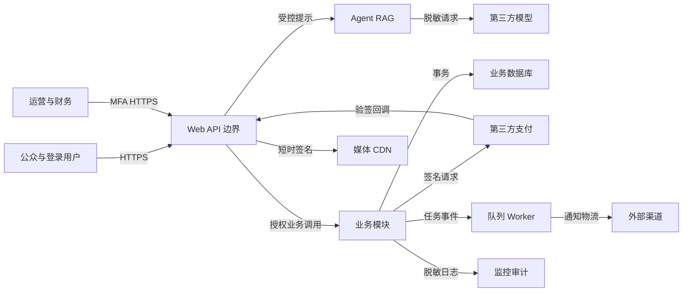

# 茶文化智能体（商业化版）开发方案

**版本：** 1.0
**日期：** 2026-09-07
**状态：** 评审稿
**适用对象：** 创始团队、产品、研发、设计、茶文化专家、课程与商品运营、客服、财务与安全负责人
**变更记录：** v1.0——依据客户访谈与已确认的公开 Web、第三方模型、第三方支付默认边界形成

## 1. Universal Idea Model

> 一个面向茶文化学习者和茶叶消费者的智能学习与消费平台，通过可信茶知识问答、个性化选茶、可单独购买的课程模块和甄选茶品服务，帮助用户从“不了解、不会选”走到“学得会、买得明白、持续复购”。

## 2. 执行摘要

商业化版把茶文化智能体建设为可持续运营的“内容—学习—商品”一体化平台。用户可以免费进行有出处的茶知识问答和口味诊断，按绿茶、普洱茶等主题单独购买课程，也可购买完整培训班与甄选茶品；平台通过课程权益、订单、支付、库存和售后形成真实交易闭环。产品采用模块化单体起步，核心交易使用关系型数据库强一致，知识问答使用可溯源 RAG，通知、索引、分析等非关键任务异步化。首期建议 18 周、5～7 人核心团队、约 400～525 人日完成邀请制上线。上线 90 天的目标是获得 2,000 名月活用户、至少 300 名月度价值达成用户，并验证不低于 5% 的付费转化率。

## 3. 问题陈述

**当前状态：** 用户通过短视频、搜索、线下茶馆和综合电商分别获取知识、学习课程和购买茶品，信息质量、学习路径和商品可信度无法连续验证。

**根因：** 茶知识专业且非标准化；课程通常整套售卖；电商推荐以交易为中心，较少解释用户为何适合某种茶；内容、课程和商品数据又由不同角色维护。

**用户痛点：**

1. 初学者面对大量术语与营销话术，不知道什么内容可信。
2. 用户想只学某个茶类，却常被迫购买整套培训。
3. 买茶时难把口味、冲泡能力、预算和饮用场景转化为具体选择。
4. 购买课程后缺少连续学习路径、进度反馈和相关茶样体验。

**业务痛点：**

1. 茶文化内容无法稳定沉淀并转化为可衡量的用户资产。
2. 课程和茶品交叉销售依赖人工，运营效率低。
3. 缺少从内容触达、学习、购买到复购的统一数据链路。

**影响：** 用户决策周期长、课程客单价门槛高、茶品推荐信任不足，团队难以衡量内容和智能体对收入的真实贡献。

**证据基础：** 需求来自客户访谈。上线前必须完成不少于 15 名初学者、10 名课程潜客和 5 名运营人员的验证访谈，访谈用于优化排序，不改变本方案已确认的产品边界。

## 4. 产品目标与成功指标

**北极星指标：月度价值达成用户数（MVU）**——自然月内至少完成一节已购课程，或完成一笔已支付茶品订单的去重用户数。

**90 天目标：**

- 月活用户 ≥ 2,000。
- MVU ≥ 300。
- 注册到首次有效问答/推荐的激活率 ≥ 60%。
- 注册用户 30 天付费转化率 ≥ 5%。
- 已购课程首节完成率 ≥ 70%。
- 已支付订单退款/售后争议率 ≤ 5%。

**失败阈值：** 公测满 90 天且累计注册用户达到 1,000 后，如果激活率低于 35%或付费转化率低于 3%，暂停扩充课程与 SKU，重新验证目标用户、首屏价值和商品/课程匹配逻辑。

### 领先指标

| 指标 | 目标 | 测量方式 | 周期 |
|---|---:|---|---|
| 首次价值时间 | 中位数 ≤ 3 分钟 | 注册/匿名进入至有效回答或推荐 | 周 |
| 问答有帮助率 | ≥ 80% | 回答反馈 | 周 |
| 引用覆盖率 | ≥ 95% | AI 评测与线上采样 | 每次发布/周 |
| 商品/课程详情点击率 | ≥ 30% | 推荐曝光到详情埋点 | 周 |
| 结算启动率 | ≥ 12% | 详情到创建结算 | 周 |

### 滞后指标

| 目标 | 指标 | 目标 | 周期 |
|---|---|---:|---|
| 用户价值 | MVU | ≥ 300/月 | 90 天 |
| 商业验证 | 付费转化率 | ≥ 5% | 90 天 |
| 学习效果 | 课程首节完成率 | ≥ 70% | 月 |
| 留存 | 注册用户第 4 周留存 | ≥ 25% | 90 天 |
| 服务质量 | 支付成功订单履约率 | ≥ 98% | 月 |

## 5. 用户画像

### 画像 A：林晓，茶文化新手

- **角色：** 20～35 岁城市消费者，愿意尝试品质茶。
- **目标：** 听懂茶知识，找到符合口味和预算的第一款茶。
- **痛点：** 害怕被术语或营销误导，不愿先报大课。
- **技术熟练度：** 中等。
- **使用场景：** 微信分享链接或搜索进入，移动端问答和选购。
- **代表性表达：** “别只告诉我哪个好，告诉我为什么适合我。”

### 画像 B：周宁，系统学习者

- **角色：** 有饮茶习惯，希望进阶或发展兴趣副业。
- **目标：** 按茶类学习，必要时升级为完整培训班。
- **痛点：** 课程结构、试听、权益和升级规则不透明。
- **技术熟练度：** 中等。
- **使用场景：** 晚间学习、反复查看冲泡资料、购买配套茶样。
- **代表性表达：** “先买普洱模块，觉得合适再补完整课程。”

### 画像 C：陈老师，内容与课程运营

- **角色：** 茶艺讲师、内容编辑或商品运营。
- **目标：** 安全发布知识、课程和商品，跟踪转化与反馈。
- **痛点：** 多份表格重复维护，内容更新无法及时进入智能体。
- **技术熟练度：** 中低。
- **使用场景：** 工作台批量编辑、审核、发布和查看数据。
- **代表性表达：** “我需要知道改了什么、谁审核的，以及回答有没有跟着更新。”

## 6. 业务范围、假设与约束

### 6.1 范围内

- 公开茶知识问答、引用溯源、对话历史与反馈。
- 口味/场景/预算/学习目标画像与可解释推荐。
- 模块化录播课程、完整培训班、试听、购买权益、学习进度和基础测验。
- 甄选茶品目录、SKU、库存、购物车、订单、第三方支付、退款申请和物流状态。
- 课程包、茶样体验包、组合购和基础优惠券。
- 内容、课程、商品、库存、订单、售后、用户与权限运营后台。
- 消息通知、数据埋点、漏斗和 AI 质量/成本看板。
- 隐私同意、数据导出/删除申请和安全审计。

### 6.2 已确认的假设

1. 首发为中国大陆用户使用的中文响应式 Web/H5，后续再考虑小程序或原生 App。
2. 运营主体具备销售茶品和在线课程所需的营业、税务、支付及内容权利条件。
3. 资金由持牌第三方支付机构处理；平台不保存银行卡号或支付密码。
4. 大模型使用第三方 API；服务端发送前执行个人信息最小化和脱敏。
5. 初期单一品牌/运营主体，不开放商家入驻和多租户 SaaS。
6. 课程以录播图文/视频为主；直播、教师一对一和证书不属于首期。
7. 茶品库存由平台维护，并通过可审计的订单状态机防止错单。

### 6.3 约束

- **周期：** 18 周完成邀请制正式版，允许 ±3 周风险缓冲。
- **团队：** 产品 1、设计 1、前端 1～2、后端 2、AI/数据 1、测试 1；茶专家、运营和安全兼职参与。
- **投入：** 400～525 人日，不含大规模课程拍摄和仓储改造。
- **基础设施预算：** 首发 5,000～20,000 元/月，根据模型用量浮动。
- **法规与平台规则：** 遵守个人信息保护、网络交易、广告宣传、消费者权益和第三方支付渠道规则；不作疾病治疗承诺。
- **可迁移性：** 模型、支付、短信和物流通过适配边界接入，不把核心业务绑定在单一供应商 SDK 内。

## 7. 明确不做（商业化 v1）

- 多商家入驻、平台抽佣、商户结算和多租户隔离。
- 自营支付、余额账户、储值卡和银行卡数据存储。
- 线下门店 POS、仓库自动化和供应链采购系统重构。
- 原生移动应用、直播课堂、一对一排课和国家认可证书。
- 用户社区、公开 UGC、私信和达人分销体系。
- 完全自主的购物 Agent 或自动替用户下单。
- 医疗诊断、药品替代、疾病治疗效果承诺。
- 多区域主动—主动部署、数据库分片和多 Agent 协作；由真实增长信号触发。

## 8. 功能需求（MoSCoW）

### 优先级分布

- **Must-have：8 项**——身份、可信问答、推荐、课程、学习权益、商品库存、订单支付、运营审计。
- **Should-have：5 项**——测验、组合营销、售后、通知和数据质量运营。
- **Could-have：2 项**——分享礼赠和人工顾问转接。
- **Won't-have：** 见第 7 节。

### FR-B01 账号、会话与权限

**用户故事：** 作为林晓，我希望匿名体验后再安全注册，以便保留结果而不被过早要求提供个人信息。
**优先级：** Must-have。

**验收标准：**

- [ ] 未登录用户可完成最多 5 次/日问答和一次测评，不可购买或查看他人数据。
- [ ] 注册后可经明确确认合并当前匿名会话；未确认时不合并。
- [ ] 用户、运营、客服、财务、管理员至少 5 类角色的接口权限自动化测试全部通过。
- [ ] 管理员和财务角色强制启用 MFA；会话撤销后 60 秒内失效。

### FR-B02 可溯源茶知识问答

**用户故事：** 作为林晓，我希望问答给出来源并承认资料边界，以便做出可信判断。
**优先级：** Must-have。

**验收标准：**

- [ ] 100 题黄金评测集事实正确率 ≥ 90%，引用覆盖率 ≥ 95%。
- [ ] 每个引用可定位到已发布资料、版本和具体段落。
- [ ] 无支持资料时明确拒绝猜测；不得伪造专家或来源。
- [ ] 20 个提示注入/医疗越界用例中，高风险违规输出为 0。

### FR-B03 用户画像与可解释推荐

**用户故事：** 作为林晓，我希望平台结合口味、预算和使用场景推荐茶、课和体验包，以便减少选择成本。
**优先级：** Must-have。

**验收标准：**

- [ ] 用户可查看、修改和删除口味、预算、茶龄、场景及学习目标。
- [ ] 每项推荐展示至少 2 条基于用户输入或历史行为的理由。
- [ ] 已下线、无售卖资格或库存不可售的商品不会进入可购买推荐。
- [ ] 50 组规则画像的硬约束满足率 ≥ 95%，且用户可选择“不感兴趣”。

### FR-B04 模块化课程目录与购买

**用户故事：** 作为周宁，我希望单独购买某茶类模块或完整培训班，以便按兴趣和预算逐步学习。
**优先级：** Must-have。

**验收标准：**

- [ ] 每门课程展示目标、章节、教师、试听、时长、有效期、价格和退款规则。
- [ ] 单模块、课程包和完整培训班的包含关系以及重复购买规则明确展示。
- [ ] 已购买模块升级完整班时，系统按已配置规则抵扣，服务器重新计算金额。
- [ ] 未发布课程无法搜索、推荐、结算或学习。

### FR-B05 学习权益与进度

**用户故事：** 作为周宁，我希望购买后立即获得正确课程并保留进度，以便持续完成学习。
**优先级：** Must-have。

**验收标准：**

- [ ] 支付成功并经服务端确认后 60 秒内生成课程权益。
- [ ] 未购买、已退款、已过期或被撤销权益的用户无法访问受限正课资源。
- [ ] 同一用户同一课时的进度更新具有幂等性，重复请求不会把完成率累加两次。
- [ ] 用户可以跨设备继续最近学习位置，进度误差不超过 10 秒。

### FR-B06 茶品、SKU 与库存

**用户故事：** 作为林晓，我希望看到准确的规格、库存状态和冲泡说明，以便放心购买甄选茶品。
**优先级：** Must-have。

**验收标准：**

- [ ] 商品与 SKU 分离；规格、批次、价格、可售库存和上下架状态由服务器管理。
- [ ] 创建订单使用原子预占或条件更新，100 个并发请求下库存不出现负数。
- [ ] 订单取消或支付超时后在规定时间内释放预占库存，释放操作幂等。
- [ ] 客户端修改价格、优惠或库存字段不会影响服务器结算结果。

### FR-B07 订单与第三方支付

**用户故事：** 作为林晓，我希望明确看到订单金额并安全付款，以便获得商品或课程权益。
**优先级：** Must-have。

**验收标准：**

- [ ] 每次创建订单和发起支付都要求唯一幂等键，重复请求只产生一个业务结果。
- [ ] 订单至少支持待支付、支付处理中、已支付、履约中、已完成、已取消、退款中、已退款和支付未知态。
- [ ] 支付回调必须验签、校验商户/金额/订单并去重；仅凭客户端成功页不得改为已支付。
- [ ] 支付超时进入未知态并主动查询渠道，不能直接判失败或重复扣款。

### FR-B08 运营后台与审计

**用户故事：** 作为陈老师，我希望按职责审核和发布内容、课程、商品并查看操作记录，以便安全运营。
**优先级：** Must-have。

**验收标准：**

- [ ] 知识、课程和商品采用草稿—审核—发布—下线状态；发布者不能审核自己提交的高风险内容。
- [ ] 价格、库存、退款、权限、知识发布等高影响操作记录前后值、操作者、时间和原因。
- [ ] 客服只能查看完成服务所需的最少订单和联系方式，不能导出全量用户。
- [ ] 审计记录不可由普通管理员修改或删除，保留不少于 3 年。

### FR-B09 课程测验与学习反馈

**用户故事：** 作为周宁，我希望在模块后验证理解并获得解释，以便知道自己是否真正掌握。
**优先级：** Should-have。

**验收标准：**

- [ ] 每模块支持客观题测验，提交后显示得分、正确答案和知识解释。
- [ ] 相同题集允许重做，历史尝试保留且不被覆盖。
- [ ] AI 生成题必须经人工审核后发布，不直接进入正式题库。

### FR-B10 组合购与优惠

**用户故事：** 作为林晓，我希望购买课程与对应茶样组合，以便边学边体验，同时清楚知道优惠来源。
**优先级：** Should-have。

**验收标准：**

- [ ] 购物车同时支持实物和数字课程，并分别展示履约方式。
- [ ] 所有优惠由服务器计算；优惠前价格、优惠金额和实付金额可追溯。
- [ ] 同一优惠券不能超次数使用；并发提交不导致重复核销。

### FR-B11 退款与售后

**用户故事：** 作为付费用户，我希望按公开规则申请退款或售后，以便问题可追踪、金额可核对。
**优先级：** Should-have。

**验收标准：**

- [ ] 用户可对符合规则的订单项提交原因、证据和期望处理方式。
- [ ] 数字课程与实物商品分别执行已公示规则，系统展示是否满足条件及原因。
- [ ] 退款金额不超过原支付可退余额；重复回调不会重复退款。
- [ ] 退款成功后相关课程权益在 60 秒内按规则撤销。

### FR-B12 通知与偏好

**用户故事：** 作为用户，我希望收到必要的交易和学习提醒，并能关闭营销信息，以免被打扰。
**优先级：** Should-have。

**验收标准：**

- [ ] 支付、退款和安全通知与营销通知分通道、分优先级。
- [ ] 营销通知默认遵循用户同意和退订选择，退订后 10 分钟内生效。
- [ ] 通知采用异步投递、幂等去重和限频；渠道失败不回滚已成功订单。

### FR-B13 数据、AI 质量与成本运营

**用户故事：** 作为运营负责人，我希望查看漏斗、问答质量和模型成本，以便决定优化内容、推荐还是渠道。
**优先级：** Should-have。

**验收标准：**

- [ ] 看板展示激活、详情、结算、支付、学习和复购关键漏斗。
- [ ] 每次 AI 调用记录模型版本、token、延迟、检索命中和估算成本，不记录明文敏感信息。
- [ ] 评测集低于门槛时阻止提示词/检索配置自动发布。
- [ ] 日成本达到预算 80% 告警，达到 100% 自动执行预设降级策略。

### FR-B14 分享与礼赠

**用户故事：** 作为林晓，我希望把课程或茶品作为礼物发送，以便在不泄露个人信息的情况下分享茶文化。
**优先级：** Could-have。

**验收标准：**

- [ ] 礼赠链接使用高熵一次性令牌并设置有效期。
- [ ] 接收者确认前不向赠送者披露其账号或地址信息。
- [ ] 重复领取只能得到同一结果，不会重复发放权益或库存。

### FR-B15 人工顾问转接

**用户故事：** 作为高意向用户，我希望在复杂问题上联系真人，以便获得智能体无法安全提供的建议。
**优先级：** Could-have。

**验收标准：**

- [ ] 转接前明确展示将共享的对话摘要和联系方式，并由用户确认。
- [ ] 用户可编辑/删除摘要内容后再提交。
- [ ] 未经同意不向顾问发送完整对话或身份信息。

## 9. 智能体内容与知识库

### 9.1 角色定位

智能体是“可信、克制、会解释的茶文化顾问”，职责是教育、澄清需求和辅助决策，不是追求每轮成交的销售机器人。它必须区分事实、业内常见观点、个人偏好和营销描述；不能伪造来源、销量、稀缺性、库存、认证或健康效果。

### 9.2 意图与工作流

| 意图 | 工作流 | 允许动作 | 禁止动作 |
|---|---|---|---|
| 知识问答 | 检索→重排→回答→引用校验 | 展示来源、追问 | 编造资料、医疗承诺 |
| 选茶 | 收集硬约束→筛选可售品→解释推荐 | 写入可撤销偏好 | 自动下单、替用户付款 |
| 学课 | 识别基础/目标→匹配模块→展示试听 | 导航到课程详情 | 绕过权益播放正课 |
| 售后咨询 | 查询本人订单→规则解释→创建工单 | 发起有确认的申请 | 自主批准退款 |
| 运营辅助 | 草稿生成→人工审核→发布 | 生成摘要/标签/题目草稿 | 自动发布高风险内容 |

**运行限制：** 单用户单轮最多 4 次模型调用、3 次检索/重排、总时限 30 秒、成本上限由套餐配置；出现重复计划或工具错误立即停止。支付、退款、权限、库存、内容发布等高影响动作由确定性服务执行并要求用户或员工明确确认。

### 9.3 知识体系

| 域 | 内容 | 首发目标 | 更新频率 | 审核者 |
|---|---|---:|---|---|
| 茶类与工艺 | 六大茶类、再加工茶、制作、产区 | 300 条 | 月 | 茶专家 |
| 冲泡品鉴 | 器具、茶水比、水温、时间、感官词 | 200 条 | 月 | 茶艺教师 |
| 历史文化 | 茶史、典籍、茶俗、礼仪、人物 | 200 条 | 季 | 内容专家 |
| 储存安全 | 储存、保质、咖啡因、特殊人群边界 | 100 条 | 季 | 专家/合规 |
| 课程 | 大纲、课时、教师、权益、规则 | 全量课程 | 实时发布 | 课程运营 |
| 商品 | SKU、批次、风味、冲泡、证据与状态 | 全量可售 SKU | 实时/日 | 商品运营 |
| 服务规则 | 配送、退款、优惠、隐私、客服 | 全量规则 | 变更即发 | 法务/运营 |

### 9.4 RAG 策略

- 使用结构/语义切块，保留标题、段落、来源和版本上下文。
- 采用关键词与向量混合召回，针对专有茶名、产地、年份和 SKU 做精确字段过滤。
- 召回后重排；必须先执行用户权限和发布状态过滤，再把片段交给模型。
- 检索内容一律视为不可信输入，移除/隔离其中的指令性文本。
- 商品价格、库存、权益和订单不从向量库回答，必须实时读取业务系统。
- 引用只能指向用户有权访问且仍有效的资料；下线资料不得用于新回答。

### 9.5 内容治理与评测

- 内容状态：草稿、待审、已发布、已下线；知识、提示词、推荐规则均版本化。
- 高风险域（健康、历史争议、价格与规则）采用双人审核。
- 首发黄金集：100 个事实问答、50 组推荐、30 个注入/越界、20 个商品/课程实时性用例。
- 发布门禁：事实正确率 ≥ 90%，引用覆盖率 ≥ 95%，推荐硬约束满足率 ≥ 95%，越权/高风险违规为 0。
- 线上每周抽样 100 次匿名脱敏回答；发现严重错误可一键下线对应内容版本并回滚提示词。

## 10. 非功能与质量属性

| 属性 | 首发目标 | 12 个月目标 | 取舍 |
|---|---|---|---|
| 性能 | 页面 p75 ≤ 2 秒；API p95 ≤ 400 ms；AI 首字 p75 ≤ 2.5 秒 | API p95 ≤ 300 ms；AI 首字 p75 ≤ 2 秒 | 完整回答可到 20 秒，但先流式反馈 |
| 可用性 | 月度 ≥ 99.9% | ≥ 99.95% | 不在 v1 建跨地域多活 |
| 一致性 | 支付/订单/库存/权益强一致或可审计补偿 | 同左 | 分析、通知、搜索允许最终一致 |
| 安全 | RBAC、MFA、TLS、加密、审计、限流、隐私权利流程 | 定期渗透与供应链治理 | 接受更多运营步骤换安全 |
| RPO/RTO | RPO ≤ 1 小时；RTO ≤ 4 小时 | RPO ≤ 15 分钟；RTO ≤ 1 小时 | 以托管多可用区和恢复演练换成本 |
| 可扩展性 | 2,000 DAU、20 API QPS、30 AI 并发 | 20,000 DAU、200 API QPS、300 AI 并发 | 按监控信号升级，不提前分片 |
| 可维护性 | 模块契约测试、ADR、单元覆盖率 ≥ 80% | 独立发布关键域 | 模块化单体优先 |
| 可观测性 | 指标、日志、trace、审计、AI token/质量 | SLO 与错误预算 | 日志必须脱敏 |
| 无障碍 | 关键购买/学习流程满足 WCAG 2.1 AA | 全站审计 | 不以动画牺牲可用性 |

## 11. 系统架构

### 11.1 Context 图

```text
[访客/学员/消费者] --HTTPS--> [茶文化智能体商业平台]
[内容/课程/商品/客服/财务] --MFA HTTPS--> [茶文化智能体商业平台]
[茶文化智能体商业平台] --API--> [第三方大模型]
[茶文化智能体商业平台] --签名API/回调--> [第三方支付]
[茶文化智能体商业平台] --API/回调--> [物流、短信/邮件]
[茶文化智能体商业平台] --受控对象访问--> [视频与图片存储/CDN]
```

### 11.2 Container 图

```text
用户/员工
   | HTTPS
+--v----------------+       +--------------------+
| Web/H5 与运营后台 |------>| CDN/媒体对象存储    |
+---------+---------+       +--------------------+
          | JSON/SSE
+---------v------------------------------------------------+
| API 网关 + 模块化单体                                    |
| 身份 | 内容 | 课程 | 学习权益 | 商品库存 | 订单支付 | 售后 |
+----+------------------+---------------------+-------------+
     | 强一致事务       | 智能问答            | 异步事件
+----v-----------+  +---v----------------+  +-v------------+
| 关系数据库      |  | Agent/RAG 编排与护栏 |  | 任务队列/Worker|
| 业务+向量扩展   |  +---+-------------+--+  +--+------------+
+----+-----------+      |             |        |
     |                  |检索         |模型    +--> 通知/索引/分析
+----v-----------+  +---v-------+ +---v--------+
| 缓存/限流/会话  |  | 混合检索   | | 第三方模型 |
+----------------+  +-----------+ +------------+

订单支付模块 <----验签/查询/退款----> 第三方支付
商品订单模块 <------状态同步--------> 物流服务
所有模块 ------指标/日志/trace/审计--> 可观测平台
```

### 11.3 领域边界

| 模块 | 拥有的数据/规则 | 禁止绕过 |
|---|---|---|
| 身份与权限 | 用户、角色、会话、同意、MFA | 其他模块不得自行判断管理员身份 |
| 内容与 RAG | 文档、块、来源、审核、索引版本 | 未发布内容不得检索 |
| 课程目录 | 课程、模块、课时、试听、价格发布 | 学习模块不得自行改价格 |
| 学习权益 | 购买权益、有效期、进度、测验 | 仅已确认支付/人工授权可发权益 |
| 商品库存 | SPU、SKU、批次、可售/预占库存 | 订单不得直接改库存字段 |
| 订单支付 | 订单、订单项、支付尝试、退款、状态机 | 客户端结果不得确认付款 |
| 营销 | 课程包、优惠券、推荐位 | 最终金额必须由订单域重算 |
| 售后 | 申请、证据、处理、退款指令 | 不得越权读取其他订单 |

### 11.4 关键数据流

**可信问答：** 请求鉴权/限流 → 意图识别 → 业务实时数据或混合检索 → 权限/发布过滤 → 重排 → 隔离提示 → 流式模型回答 → 引用校验/安全后处理 → 展示 → 脱敏观测与反馈。

**课程购买：** 服务端读取课程价格/权益 → 创建待支付订单和支付尝试（幂等）→ 第三方支付 → 验签回调并主动查询 → 单库事务确认订单与写出 Outbox 事件 → Worker 发放权益和通知 → 对账修复未知态。

**茶品购买：** 服务端结算 → 原子预占库存 → 支付确认 → 转履约 → 物流状态异步更新 → 完成；取消/超时/退款按状态机补偿库存，所有补偿幂等。

## 12. 容量、性能与成本估算

### 12.1 首发与 12 个月假设

| 指标 | 首发 | 12 个月 |
|---|---:|---:|
| MAU / DAU | 10,000 / 2,000 | 100,000 / 20,000 |
| API 行为/DAU/日 | 30 | 40 |
| API 平均 QPS | 0.7 | 9.3 |
| API 峰值（约 20 倍平均） | 14，按 20 压测 | 186，按 200 压测 |
| AI 请求/日 | 6,000 | 60,000 |
| 单次 AI token | 输入 2,000；输出 600 | 输入 1,800；输出 500（缓存/路由后） |
| AI token/月 | 4.68 亿 | 41.4 亿 |
| AI 峰值并发 | 30 | 300 |
| 订单/日 | 100 | 2,000 |
| 内容知识块 | 20,000 | 500,000 |
| 业务结构化数据新增 | 约 1 GB/月 | 10～30 GB/月 |
| 媒体 | 首发 500 GB | 5～10 TB |

### 12.2 成本模型与预算

- **模型：** `月调用量 ×（输入 token × 输入单价 + 输出 token × 输出单价）`。通过上下文裁剪、精确缓存和按难度模型路由控制成本。
- **媒体：** `存储 GB × 单价 + CDN 下行 GB × 单价 + 转码任务费`。
- **业务基础设施：** 应用、托管关系库、缓存、队列、对象存储、监控和备份。
- **第三方渠道：** 支付按成交额费率；短信按条；物流按接口套餐。

首发月预算建议：模型 3,000～12,000 元、基础设施 1,500～5,000 元、监控/短信/备份 500～3,000 元，总计 5,000～20,000 元，不含支付交易手续费和视频制作。必须按“每个激活用户、每个 MVU、每笔支付订单”的单位经济成本监控，而不是只看服务器总账。

### 12.3 首要瓶颈与 100 倍反挑战

首个瓶颈是 AI 模型并发、token 成本和 RAG 质量，不是订单数据库。流量增长 10 倍时先做精确缓存、模型路由、检索优化和多副本；订单增长后才加入读副本、独立搜索和领域队列。增长 100 倍时，媒体带宽与热门内容缓存成为第二瓶颈，使用 CDN 预热和分层存储。数据库只有在 CPU 持续 >70%、单表千万级、单库数百 GB 或写 QPS 接近上限时才考虑分片。

## 13. 数据模型与存储

| 聚合/模型 | 关键字段与类型 | 约束与关系 | 存储/一致性 |
|---|---|---|---|
| User | id UUID、phone/email encrypted、status enum、created_at UTC | 联系方式唯一；软删除；一对多会话/订单 | 关系库，强一致 |
| Consent | id、user_id、purpose enum、version、granted_at、revoked_at | 每个用途/version 可审计 | 关系库，强一致 |
| RoleAssignment | user_id、role enum、scope、expires_at | 联合唯一；最小权限 | 关系库，强一致 |
| KnowledgeDocument | id、title、source_ref、risk_level、status、reviewer、version | 已发布必须有来源/审核人 | 关系库，强一致 |
| KnowledgeChunk | id、document_id、content、embedding vector、search_text、metadata json | 继承发布/权限状态 | 关系库向量扩展+全文索引，最终一致索引 |
| Course/CourseModule/Lesson | UUID、名称、目标、顺序、媒体、状态、价格版本 | 课程包含模块，模块包含课时 | 关系库；媒体在对象存储 |
| Entitlement | id、user_id、scope_type、scope_id、source_order_item、valid_from/to、status | 来源订单项唯一；不可重复发放 | 关系库，强一致 |
| Progress | user_id、lesson_id、position_seconds、completed_at、version | 用户+课时唯一；乐观并发 | 关系库，读写一致 |
| Product/SPU | id、name、category、origin、content_status | 一对多 SKU | 关系库 |
| SKU/Inventory | id、product_id、spec、price_cent、available_qty、reserved_qty、version | 数量非负；条件更新 | 关系库，强一致 |
| Order | id、order_no、user_id、status、currency、amount_cent、version、idempotency_key | order_no/idempotency 唯一；状态机 | 关系库，强一致 |
| OrderItem | order_id、item_type、item_id、price_snapshot、qty | 保存不可变成交快照 | 关系库 |
| PaymentAttempt | id、order_id、channel_ref、status、amount、idempotency_key | 渠道引用/幂等键唯一 | 关系库，强一致+对账 |
| Refund | id、payment_id、amount、status、reason、channel_ref | 累计不超过可退余额 | 关系库，强一致 |
| Shipment | id、order_id、carrier、tracking_no encrypted、status | 一订单可拆多个包裹 | 关系库，最终一致物流状态 |
| Conversation/Message | id、user_id/anonymous_id、redacted_content、citations、model_version、expires_at | 默认 90 天；用户可删除 | 关系库；敏感字段加密 |
| OutboxEvent | id、aggregate_type/id、event_type、payload、status、created_at | 与业务事务同库提交；幂等消费 | 关系库+队列 |
| AuditLog | id、actor、action、target、before/after_digest、reason、timestamp | 追加写；至少 3 年 | 独立审计存储 |

**索引：** 用户联系方式哈希唯一索引；订单 `user_id, created_at`；支付 `channel_ref` 唯一；库存 `sku_id`；课程 `status, category`；知识全文与向量索引；事件使用游标分页，不使用高偏移分页。

## 14. API 规格

### POST /api/v1/chat/stream

**认证：** 匿名限额或登录会话。
**请求：**

```json
{
  "conversation_id": "01J7K1G2M4N6P8R0T2V4X6Z8AB",
  "message": "我喜欢清香、不太苦，预算两百元，适合什么茶？",
  "consent_to_personalize": true
}
```

**响应：** SSE `answer_delta`、`citation`、`recommendation_ref`、`usage`、`done`。错误：400、401、429、503；不在错误中暴露提示词或供应商信息。

### POST /api/v1/recommendations

根据可撤销画像返回茶类、课程和可售 SKU；响应包含 `reasons[]`、`constraints_used[]` 和 `generated_at`，不返回用户无权访问或不可售实体。

### POST /api/v1/orders

**认证：** 登录必需。
**Header：** `Idempotency-Key` 必需。

```json
{
  "items": [
    {"type": "course_module", "id": "course_puer_101", "quantity": 1},
    {"type": "sku", "id": "sku_puer_sample_50g", "quantity": 1}
  ],
  "coupon_code": "TEA101",
  "shipping_address_id": "addr_01J7K2"
}
```

```json
{
  "order_no": "T20260907000125",
  "status": "pending_payment",
  "pricing": {"subtotal_cent": 39800, "discount_cent": 3000, "shipping_cent": 0, "payable_cent": 36800},
  "expires_at": "2026-09-07T13:30:00Z"
}
```

### POST /api/v1/payments

提交 `order_no`、`channel` 和幂等键；服务器检查订单归属、状态和金额后创建支付尝试，返回第三方支付所需的短期参数。

### POST /api/v1/payment-webhooks/{channel}

不使用用户会话；必须验签、时间窗校验、商户校验、金额校验和去重。总是先持久化原始回调摘要，再推进状态机；重复合法回调返回成功但不重复发权益。

### POST /api/v1/refunds

用户提交订单项、金额和原因；接口只创建退款申请，最终退款由权限和规则审批流程执行。

### PUT /api/v1/progress/{lesson_id}

提交 `position_seconds`、`completed`、`client_version` 和幂等键；服务端保留最大合理进度并处理版本冲突。

### POST /api/v1/admin/knowledge/{id}/publish

要求内容管理员权限、MFA 和审核记录；发布写审计与 Outbox 事件，索引异步更新，前端显示索引状态。

## 15. UI/UX 要求

### 首页与智能对话

- 首屏让用户在“问茶、选茶、学茶、买茶”四个意图中快速开始，也允许自由提问。
- 不登录即可体验；保存画像、购买和学习时再解释注册收益。
- 回答先给结论与边界，再给依据；推荐必须展示“为什么适合你”。
- 明确区分知识回答、用户偏好建议和商品推广内容。

### 课程商城与学习中心

- 支持按茶类、难度、时长和形式筛选；单模块与完整班差异清楚。
- 详情展示试听、教师资质、课程目标、权益期限、退款规则与升级抵扣规则。
- 学习中心显示最近学习、模块进度、有效期和下一步，不制造虚假完成感。

### 茶品商城与结算

- 商品页展示规格/批次、风味、产区、冲泡、库存状态、配送与售后。
- 结算页分开展示数字课程和实物商品的交付方式。
- 付款前明确商品、数量、地址、优惠、实付金额和条款；禁止默认勾选营销同意。

### 运营后台

- 以角色展示最小功能集；高影响操作显示影响范围并二次确认。
- 内容发布、价格库存、订单售后、权限和审计分区，避免一个页面拥有全部权力。
- 空、加载、错误、冲突和成功状态都有清晰恢复动作。

## 16. 外部集成

| 集成 | 入站/出站数据 | 认证与控制 | 失败降级 | 首发必需 |
|---|---|---|---|---|
| 第三方大模型 | 出站脱敏问题/片段；入站文本/用量 | 服务端密钥、超时、配额、供应商适配 | 小模型/只读内容/稍后重试 | 是 |
| 第三方支付 | 订单号、金额、渠道流水、回调 | API 密钥、签名、IP/证书策略、主动查询 | 未知态+对账，不重复扣款 | 是 |
| 对象存储/CDN | 视频、图片、附件 | 私有源站、短时签名、转码与类型验证 | 降码率/静态封面 | 是 |
| 物流服务 | 收件必要信息、运单状态 | 服务端凭证、最小字段 | 人工录入与查询 | 是（实物） |
| 短信/邮件 | 验证码、交易/学习通知 | 模板、限频、签名、退订 | 站内消息 | 是 |
| 监控/分析 | 脱敏事件、指标、trace | 字段白名单、权限、留存 | 本地缓冲后补传 | 是 |

## 17. 异常、幂等与降级

| 场景 | 预期行为 |
|---|---|
| 支付回调丢失/重复/乱序 | 主动查询+对账；按状态机和唯一约束幂等处理 |
| 支付超时但用户已扣款 | 标记“支付确认中”，禁止重复支付，查询后确定结果 |
| 库存预占后支付失败 | 超时任务幂等释放；与订单状态核对 |
| 权益事件重复 | 以来源订单项唯一约束返回原权益 |
| 模型不可用 | 商品、课程、订单与学习仍可用；问答降级到搜索/固定内容 |
| 搜索索引延迟 | 详情读取主库；后台展示索引进度；下线走高优先级删除 |
| 视频/CDN 故障 | 提供低码率或文字讲义；记录断点 |
| 通知渠道失败 | 队列退避重试，交易结果不回滚，站内消息保留 |
| 并发修改内容/库存 | 乐观版本冲突，提示刷新，不静默覆盖 |
| 用户申请删除 | 校验身份；删除/匿名化非强制留存数据；保留法定义务所需最小记录 |

## 18. 安全威胁模型（设计期）

### 18.1 范围与假设

本模型覆盖公开 Web/API、员工后台、身份权限、Agent/RAG、课程媒体、订单库存、第三方支付/物流/通知、日志与审计。运行代码尚未实现，因此以下“设计控制”均是发布门槛，不代表已有安全事实；开发完成后须对真实仓库重新建模。自营支付、商户入驻、原生 App、直播与多租户不在 v1 范围。

### 18.2 信任边界图



### 18.3 资产与安全目标

| 资产 | 为什么重要 | 目标（C/I/A） |
|---|---|---|
| 账号、联系方式、地址、对话 | 个人信息与用户信任 | C/I/A |
| 订单、支付、退款、库存、权益 | 资金与履约正确性 | I/A，支付数据 C |
| 课程视频和版权内容 | 商业资产 | C/I/A |
| 知识、提示词、推荐规则 | 回答和推荐完整性 | I/A，部分 C |
| 模型/支付/渠道密钥 | 泄露可导致费用、数据和资金风险 | C/I |
| 权限与审计记录 | 追责、风控和合规 | I/A |
| 服务容量与模型额度 | 防止业务和费用型拒绝服务 | A |

### 18.4 攻击者模型

**能力：** 互联网攻击者可注册账号、构造 API/提示、自动化请求、篡改客户端字段、尝试撞库和枚举；恶意客户可发起优惠/退款/支付争议；被盗员工账号可访问后台；恶意或受污染资料可进入内容草稿；第三方回调和依赖可能被伪造或中断。
**非能力：** 默认攻击者无云平台、生产数据库或支付机构内部权限；平台不保存银行卡号/支付密码；v1 无跨商户租户边界。

### 18.5 入口与攻击面

| 表面 | 到达方式 | 边界 | 设计证据 |
|---|---|---|---|
| 登录/注册/找回 | 公开 HTTPS | 互联网→身份 | FR-B01、NFR 安全 |
| Chat/RAG | 公开或登录 API | 用户→Agent→模型 | FR-B02、第 9 节 |
| 推荐/目录 | API | 用户→业务数据 | FR-B03～B06 |
| 订单/支付/退款 | 登录 API/外部回调 | 用户/支付→交易核心 | FR-B07、B11、第 14 节 |
| 员工后台 | MFA HTTPS | 员工→高权限业务 | FR-B08 |
| 内容/媒体上传 | 后台上传 | 员工文件→存储/解析 | 内容治理、外部集成 |
| 课程媒体播放 | 短时签名 URL | 用户→CDN | 学习权益、媒体集成 |
| 日志/数据看板 | 内部访问 | 生产→监控/分析 | FR-B13 |

### 18.6 主要滥用途径

1. 攻击者提示注入 → 诱导模型泄露系统规则或调用越权工具 → 获取信息或误导用户。
2. 恶意内容进入已发布知识 → 经 RAG 影响大量回答 → 信誉和消费决策受损。
3. 用户篡改客户端价格/优惠/订单归属 → 服务端信任字段 → 低价购买或越权退款。
4. 伪造或重放支付回调 → 订单误判已支付 → 免费获得课程/商品。
5. 竞态重复请求 → 库存、优惠、权益或退款重复执行 → 资金与库存损失。
6. 普通客服越权查询他人订单/地址 → 批量导出个人信息 → 隐私事件。
7. 盗链或猜测媒体 URL → 未购用户下载课程 → 内容资产泄露。
8. 自动化问答和短信轰炸 → 耗尽模型/渠道额度 → 成本上升和服务不可用。
9. 依赖或密钥泄露 → 攻击者访问模型、支付或存储 → 跨系统影响。

### 18.7 威胁表

| ID | 威胁 | 前提 | 影响资产/结果 | 设计控制 | 缺口与推荐措施 | 检测 | 可能性 | 影响 | 优先级 |
|---|---|---|---|---|---|---|---|---|---|
| TM-B01 | 直接/间接提示注入 | 可提交提示或影响资料 | 提示词、知识、用户决策 | 固定工具白名单、资料隔离、无支付工具 | 注入评测；输出策略；高影响动作永不由模型直执 | 注入命中、异常工具请求 | 高 | 高 | 高 |
| TM-B02 | 知识投毒/越权检索 | 账号可发布或索引过滤错误 | 商业内容、私有课程、信誉 | 审核流、状态/权限过滤、版本回滚 | 高风险双人审核；过滤必须在检索前；红队回归 | 发布后评测跌落、异常来源 | 中 | 高 | 高 |
| TM-B03 | 认证/授权绕过 | 弱会话或对象级授权缺失 | PII、订单、权益、后台 | RBAC、MFA、服务端对象归属校验 | 每端点资源级授权；短会话；批量接口限制 | 403/404 枚举、异常导出 | 中 | 高 | 高 |
| TM-B04 | 伪造/重放支付回调 | 回调校验不完整 | 订单、资金、权益、库存 | 验签、金额/商户校验、唯一渠道流水、主动查询 | 密钥轮换；时间窗/nonce；每日对账 | 回调与主动查询不一致 | 中 | 高 | 高 |
| TM-B05 | 交易竞态与非幂等 | 并发/重试/乱序 | 库存、优惠、退款、权益 | 幂等键、唯一约束、状态机、Outbox、补偿 | 并发故障注入；未知态处理；不可变成交快照 | 重复流水、负库存、状态逆转 | 中 | 高 | 高 |
| TM-B06 | 个人信息泄露 | 越权、日志、第三方出站 | 联系方式、地址、对话 | 加密、最小字段、脱敏日志、同意与留存 | 数据映射；DLP；导出审批；供应商条款审查 | 大量读取、敏感字段扫描 | 中 | 高 | 高 |
| TM-B07 | 课程媒体盗链 | 签名弱或长期 URL 外泄 | 课程版权与收入 | 短时签名 URL、权益校验、私有源站 | 会话绑定、水印、并发设备限制 | 异常地域/并发下载 | 高 | 中 | 高 |
| TM-B08 | 成本/容量拒绝服务 | 可自动化访问 | 模型额度、短信、服务可用性 | 多维限流、验证码、预算熔断、缓存 | 设备/IP/账号联合风控；分优先级配额 | token、短信、429、并发告警 | 高 | 中 | 高 |
| TM-B09 | 员工滥用/账号接管 | 高权限凭证泄露或恶意内部人 | PII、价格、退款、内容 | MFA、最小权限、职责分离、追加审计 | 临时提权、导出审批、异常行为分析 | 异地登录、批量查询/退款 | 中 | 高 | 高 |
| TM-B10 | 供应链/密钥泄露 | 依赖被污染或配置错误 | 所有外部能力与数据 | 密钥管理、环境隔离、依赖锁定、扫描 | SBOM、签名构建、轮换演练、最小出站权限 | 密钥扫描、异常供应商调用 | 中 | 高 | 高 |

### 18.8 风险校准

- **严重：** 可导致大规模资金错误、支付绕过、管理员接管、批量 PII 泄露或生产密钥失陷。
- **高：** 可稳定获得未购权益、污染大批知识回答、批量盗取课程或使交易核心长时间不可用。
- **中：** 需要特定前提的小范围信息泄露、可恢复的成本型拒绝服务或单订单错误。
- **低：** 不涉及敏感数据和交易、影响短暂且可自行恢复的非核心体验问题。

### 18.9 重点安全评审路径（实施后）

| 计划路径 | 原因 | 威胁 |
|---|---|---|
| `src/identity/` | 会话、MFA、角色与对象授权 | TM-B03、B06、B09 |
| `src/agent/` | 提示隔离、工具白名单和循环上限 | TM-B01 |
| `src/rag/` | 内容权限、发布过滤、投毒和引用 | TM-B01、B02 |
| `src/orders/` | 金额快照、状态机和归属 | TM-B03、B05 |
| `src/payments/` | 验签、幂等、未知态、退款和对账 | TM-B04、B05 |
| `src/inventory/` | 原子预占、释放和并发 | TM-B05 |
| `src/entitlements/` | 课程访问和重复发放 | TM-B03、B05、B07 |
| `src/privacy/` | 同意、脱敏、导出和删除 | TM-B06 |
| `src/admin/` | 职责分离和高影响操作 | TM-B09 |
| `infra/` | 密钥、网络、备份、构建与依赖 | TM-B08、B10 |

## 19. ADR 关键决策

### ADR-B01：模块化单体起步

- **决定：** 单一业务部署单元，按清晰领域模块和数据库所有权约束组织。
- **理由：** 5～7 人团队的事务一致性、开发速度和可运维性优先。
- **放弃：** 微服务独立伸缩与部署自由。
- **代价：** 需要契约和代码边界防止单体退化。
- **升级信号：** 多团队发布持续互相阻塞，或支付/RAG/媒体资源需求独立到数量级差异。

### ADR-B02：关系库同时承载首期业务与向量扩展

- **决定：** 订单、库存、权益、内容元数据用关系库；小中规模向量使用数据库向量扩展，全文索引用于混合检索。
- **理由：** 首期 50 万知识块以内可减少独立系统数量。
- **放弃：** 专用向量库的超大规模能力。
- **代价：** 检索与交易资源需隔离连接池和容量。
- **升级信号：** 向量规模超百万级且检索 p95/过滤效率不达标，或索引重建影响业务库。

### ADR-B03：RAG + 混合检索，不用微调承载事实

- **决定：** 事实与实时内容由 RAG/业务 API 提供，模型微调只可能用于风格或分类。
- **理由：** 内容持续更新且需要引用、权限和撤回。
- **代价：** 检索、重排、引用校验和评测是长期管线。
- **升级信号：** 召回/准确率低于 90%时先优化切块、混合检索和重排。

### ADR-B04：第三方支付薄接入

- **决定：** 资金托管给持牌渠道；平台维护订单、支付尝试、未知态、幂等和对账，不存卡数据。
- **理由：** 缩小合规和安全范围。
- **代价：** 受渠道费率、可用性和回调语义约束。
- **升级信号：** 多渠道路由、分账或复杂清结算成为真实业务需求时另立项目。

### ADR-B05：单库事务 + Outbox + 补偿，而非分布式大事务

- **决定：** 核心状态在本地事务提交，同时写 Outbox；权益、通知、索引和物流异步消费并幂等补偿。
- **理由：** 避免长事务和外部依赖拖死交易。
- **代价：** 周边数据短暂最终一致，需要对账和重试。
- **升级信号：** 队列积压影响 SLA、补偿量超人工处理能力时拆独立 Worker/域服务。

### ADR-B06：确定性业务代码控制高影响动作

- **决定：** Agent 可查询和建议，但不能直接确认支付、退款、库存、权限或发布。
- **理由：** 自主性不能牺牲资金正确性、可审计性和用户确认。
- **代价：** 对话流程需要显式跳转和确认，自动化程度较低。
- **升级信号：** 只有经过安全评测、权限沙箱和人工审批后才逐项开放低风险工具。

## 20. 实施路线、团队与人日

| 阶段 | 周期 | 主要交付 | 人日 |
|---|---|---|---:|
| 产品与验证 | 第 1～2 周 | 访谈、原型、内容模型、黄金评测、交易规则 | 30～40 |
| 基础与身份 | 第 3～5 周 | 数据层、部署、身份/RBAC/MFA、审计、CMS 骨架 | 55～70 |
| 内容、RAG 与推荐 | 第 4～8 周 | 导入审核、混合检索、Agent 护栏、画像推荐 | 75～95 |
| 课程与学习 | 第 6～10 周 | 课程目录、试听、权益、播放、进度、测验 | 60～80 |
| 商品与交易 | 第 8～13 周 | SKU/库存、购物车、订单、支付、对账、退款 | 90～120 |
| 运营与通知 | 第 11～15 周 | 后台、营销、售后、通知、漏斗和成本看板 | 45～65 |
| 硬化与上线 | 第 14～18 周 | 性能、安全、灾备、可用性、灰度和运营演练 | 45～55 |
| **总计** | **18 周** | **邀请制商业化 v1** | **400～525** |

**估算口径：** 包含产品、设计、开发、测试、基础安全和内容工具，不含课程视频大规模制作、线下仓储和客服人力。准确度为 ±25%，在第 2 周范围冻结后重新估算。

### 演进路线

- **MVP（0～3 个月）：** 模块化单体、单品牌、第三方模型/支付、混合检索、核心课程与茶品闭环。
- **成长期（3～12 个月）：** 应用多副本、读缓存/副本、独立搜索、模型路由、完善对账、优惠与运营自动化。
- **成熟期（12 个月以后）：** 仅在指标触发时拆 Agent、交易、媒体等服务；向量库分片、跨故障域容灾和精细成本治理。

## 21. 测试要求

- **单元测试：** 金额、优惠、库存、状态机、幂等、权益、授权、脱敏和推荐规则；核心域覆盖率 ≥ 85%，全局 ≥ 80%。
- **契约测试：** 支付、物流、模型、短信适配层；模拟超时、重复、乱序和错误签名。
- **集成测试：** 支付确认→权益/库存/通知；退款→权益撤销/库存；发布→索引→问答引用。
- **端到端：** 匿名体验→注册→推荐→购买课程→学习；购买茶品→支付→发货→售后。
- **AI 评测：** 黄金集全部运行；事实 ≥ 90%、引用 ≥ 95%、硬约束 ≥ 95%、高风险违规 0。
- **并发与性能：** 20 API QPS、30 AI 并发持续 30 分钟；库存 100 并发不超卖；支付重复回调 1,000 次只产生一次结果。
- **安全：** SAST、依赖/密钥扫描、DAST、对象越权、支付回调、上传解析、提示注入、日志 DLP、管理员流程；上线前独立渗透测试。
- **恢复演练：** 每季度恢复备份；验证首发 RPO≤1 小时、RTO≤4 小时。
- **可用性：** 每个主画像至少 5 人完成指定任务；购买和学习核心任务成功率 ≥ 85%。

## 22. 发布标准与上线策略

### 发布门槛

| 维度 | 阻断标准 |
|---|---|
| 功能 | 8 项 Must-have 全部通过；支付、权益、库存、退款主路径 E2E 通过 |
| 正确性 | 无负库存、重复扣款/退款、错误发权益；对账差异可定位可补偿 |
| AI 质量 | 事实 ≥ 90%、引用 ≥ 95%、推荐约束 ≥ 95%、高风险违规 0 |
| 安全 | 无未接受的严重/高风险；MFA、RBAC、验签、幂等、审计、密钥管理有效 |
| 性能 | 首发目标负载下 API p95≤400 ms、错误率<1%，AI 首字 p75≤2.5 秒 |
| 可靠性 | 月度 99.9%设计能力；备份恢复演练达成 RPO/RTO |
| 运营 | 客服、退款、内容下线、支付未知态、模型降级和事故手册完成 |

### 上线节奏

1. 第 8 周内部 Alpha：知识、推荐和课程浏览。
2. 第 13 周员工交易沙箱：订单、库存、支付、权益和退款。
3. 第 16 周 100 人邀请 Beta：真实小额交易、每日对账。
4. 第 18 周 10%灰度 → 50% → 全量，每阶段至少观察 48 小时。
5. 发布使用蓝绿或滚动部署；数据库变更向前/向后兼容，指标超阈自动回滚应用。

### 30/60/90 天检查

- 30 天：激活、问答质量、支付成功、履约与严重投诉。
- 60 天：课程首节完成、退款原因、推荐到购买转化、单位 AI 成本。
- 90 天：MVU、付费转化、留存和复购；触发成功/失败阈值评审。

## 23. 风险与缓解

| 风险 | 可能性 | 影响 | 缓解 |
|---|---|---|---|
| 内容或 AI 输出不可信 | 中 | 高 | 专家审核、混合检索、引用校验、评测门禁、快速回滚 |
| 课程/茶品供给不足导致闭环虚弱 | 中 | 高 | 首发聚焦 2～3 个强茶类；每类配课程+茶样 |
| 支付/库存/权益一致性错误 | 中 | 高 | 状态机、幂等、唯一约束、Outbox、补偿、对账 |
| 获客成本高于毛利 | 高 | 高 | 监控按 MVU 的渠道和 AI 成本；邀请制验证再扩投 |
| 课程视频版权或茶品宣传争议 | 中 | 高 | 权利证明、发布审核、禁用医疗和虚假稀缺表述 |
| 第三方模型/支付锁定或故障 | 中 | 高 | 适配层、超时降级、数据可迁移、支付未知态 |
| 员工权限过大造成隐私/资金风险 | 中 | 高 | MFA、职责分离、临时提权、审计和异常检测 |
| 范围膨胀到社区/直播/多商户 | 高 | 中 | v1 排除项和变更委员会；新域单独 PRD/ADR |

**风险评审频率：** 每个迭代评审；支付、安全和高风险内容每周专项复盘。

## 24. 运维、监控与升级信号

### 必须监控

- 用户：激活、MVU、转化、学习完成、退款与投诉。
- API：吞吐、p50/p95/p99、错误率、连接池和慢查询。
- AI：首字/完整延迟、token、单次成本、缓存命中、召回、引用和安全违规。
- 交易：订单状态停留、支付未知态、回调/主动查询差异、对账差异、负库存尝试。
- 异步：队列深度、最老消息年龄、重试与死信。
- 安全：登录异常、越权、管理员导出、密钥调用、DLP、注入和额度异常。

### 架构升级信号

- 主库 CPU 持续 >70%或读请求排队：先优化查询/缓存，再增加读副本。
- 缓存命中率 <90%且回源压力明显：调整粒度、TTL、预热和防击穿。
- 单表千万级、单库数百 GB或写 QPS接近上限：再论证分片并写新 ADR。
- AI 召回/准确率低于门槛：升级切块、混合检索、重排和上下文增强。
- AI 成本使毛利转负或首字延迟持续超标：模型路由、缓存、多供应商故障转移。
- 队列等待主导用户可见延迟：拆优先级、扩 Worker、隔离交易/营销通道。
- 多团队因单体发布互相阻塞：先修模块边界，再拆独立服务。

## 25. 实施约束（供 AI/研发）

### 构建顺序

1. 数据模型、迁移、审计、Outbox。
2. 身份、RBAC、MFA、同意和隐私权利。
3. 内容治理、课程/商品目录和状态机。
4. RAG、评测、Agent 护栏和推荐。
5. 库存、订单、支付、对账和退款。
6. 学习权益、播放、进度和测验。
7. 运营、通知、分析、性能与安全硬化。

### 不可违反的行为规则

- 金额统一使用最小货币单位整数；成交时保存不可变价格/规则快照。
- 支付、退款、库存、优惠核销和权益写入必须幂等并有数据库唯一约束。
- 支付超时不是失败；必须支持未知态、查询补偿和对账。
- 客户端价格、权限、库存和支付成功状态一律不可信。
- 所有业务对象接口同时校验角色权限和具体资源归属。
- AI/检索文本是不可信输入；模型不得直接执行高影响业务动作。
- 只有已发布且有权访问的知识可检索；商品实时状态只读业务主数据。
- 敏感信息不得进入模型提示、普通日志、分析事件或错误堆栈。
- 所有时间存 UTC；外部 ID 使用高熵标识；用户数据软删除并执行留存策略。

## 26. 开放决策（按默认值可开工）

| 决策 | 当前默认 | 负责人 | 最晚确认点 |
|---|---|---|---|
| 具体云与大模型供应商 | 使用适配层，选满足中文质量、稳定性和数据条款者 | 技术/安全负责人 | 第 3 周 |
| 支付渠道与经营主体 | 单一合法主体接 1 家持牌渠道 | 财务/法务 | 第 6 周前 |
| 课程退款与升级抵扣细则 | 下单前版本化展示，按订单快照执行 | 课程/法务 | 第 6 周 |
| 首发茶类和 SKU | 2～3 个优势茶类、20～50 个 SKU | 商品负责人 | 第 4 周 |
| 对话默认留存期 | 90 天，可由用户提前删除 | 隐私负责人 | Beta 前 |
| 视频防盗强度 | 私有源站+短时签名+基础水印 | 课程负责人 | 第 9 周 |

这些决策均有可执行默认值，不构成文档占位；若经营主体、支付渠道或数据出境条件变化，必须重新安全与合规评审。

## 27. 方案自检

### 27.1 PRD 五项质量信号

| 检查 | 结果 | 证据 |
|---|---|---|
| 工程可估算 | 通过 | 边界、领域、接口、数据、容量、人日与门槛明确 |
| 设计可原型 | 通过 | 画像、页面目标、主流程、状态与错误完整 |
| 业务可复述 | 通过 | 一句话模型、执行摘要和业务闭环明确 |
| 成功预定义 | 通过 | 单一北极星、90 天目标和失败阈值 |
| 排除项无意外 | 通过 | 多商户、自营支付、直播、社区等明确延期 |

### 27.2 系统设计八项诊断

| 诊断项 | 结果 | 证据 |
|---|---|---|
| 功能与非功能需求 | 通过 | 第 8、10 节 |
| QPS 与存储估算 | 通过 | 第 12 节首发/12 月容量 |
| 组件冗余 | 通过 | 无状态应用多副本、托管多可用区数据库、队列持久化、供应商降级与备份恢复 |
| 数据库扩展策略 | 通过 | 垂直/查询优化→缓存→读副本→信号触发分片 |
| 读路径缓存 | 通过 | CDN、目录缓存、精确问答缓存并定义失效/版本 |
| 异步队列 | 通过 | Outbox 驱动权益、通知、索引、物流、分析；交易核心不依赖异步确认正确性 |
| 监控告警 | 通过 | 第 24 节业务、API、AI、交易、队列与安全指标 |
| 部署策略 | 通过 | 邀请 Beta、分阶段灰度、蓝绿/滚动、兼容迁移和自动回滚 |

**系统设计评分：10/10（8/8）。** 评分代表设计覆盖完整，不代表已经通过生产验证；所有控制仍需通过代码、配置、测试和演练证明。

### 27.3 威胁模型质量检查

- 已覆盖公开、登录、员工、第三方回调、文件/媒体、日志等入口。
- 每个主要信任边界至少映射一个威胁。
- 已区分生产运行时与未来 CI/构建供应链风险。
- 用户已确认互联网公开、第三方模型、第三方支付、单一运营主体等默认上下文。
- 代码尚未实现，所有“控制”明确标为发布要求，实施后需仓库级重新验证。

### 27.4 文档完整性检查

- 无 TBD、TODO 和空白占位符。
- 15 项功能均含具体用户故事、MoSCoW 优先级和二元验收标准。
- 产品、智能体内容、架构、数据流、数据/API、容量成本、计划估算、测试发布、ADR、风险和安全威胁模型全部覆盖。
- 交易强一致边界、AI 最小权限边界及隐私边界在需求、架构、数据和测试中保持一致。

## 附录：术语

| 术语 | 定义 |
|---|---|
| MVU | 当月至少完成一节已购课或一笔已支付茶品订单的去重用户 |
| RAG | 从受控知识库检索相关资料后再生成有来源回答 |
| Outbox | 业务事务内写出待发布事件，避免数据库与消息队列双写不一致 |
| 幂等 | 同一请求重复执行仍只产生一次业务效果 |
| 支付未知态 | 渠道超时后无法判断成功或失败，必须查询与对账，不能直接重试扣款 |
| RPO/RTO | 可接受的数据丢失时间窗口/服务恢复时间目标 |
| ADR | 记录架构决策、放弃项、代价与升级信号的文档 |
